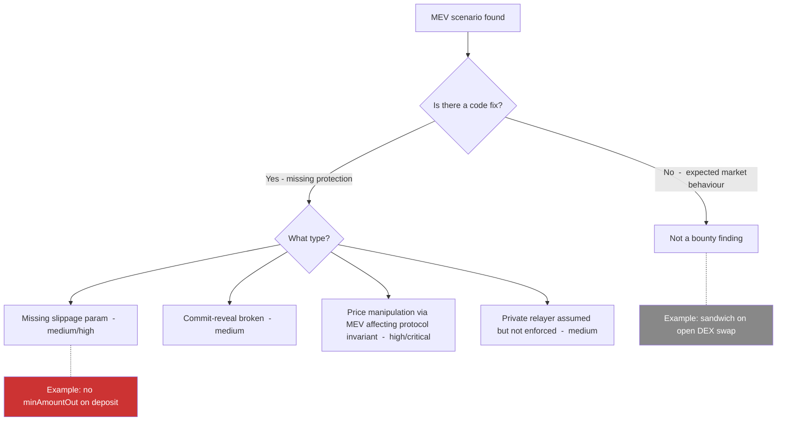

> Source: https://bugbounty.info/Attack-Surface/Web3/MEV-and-Frontrunning

# MEV and Frontrunning

Not every MEV issue is a bug bounty finding. Sandwich attacks on swaps are ambient risk, not a vulnerability in the contract code. The bounty-relevant subset is narrower: slippage controls that are missing or bypassable, commit-reveal schemes that fail to protect sensitive data, and protocol-level logic that pays attackers more than honest users when transaction ordering is manipulated.

## What Counts as a Bug vs Ambient MEV



**Ambient (not a finding):** generalised sandwich attacks on public DEX swaps, basic frontrunning of public transactions, MEV bots profiting from public arbitrage opportunities.

**Bounty-eligible:** missing slippage parameters that let MEV extract value from protocol users, commit-reveal implementations that leak the committed value, protocol functions that must run in a specific order but don't enforce it.

## Sandwich Attacks

A sandwich attack wraps a victim transaction between a buy and a sell to extract value from their price impact.

1. Victim sends a large swap: 100 ETH for USDC, with 1% slippage tolerance
2. MEV bot sees the pending transaction in the mempool
3. Bot buys USDC before the victim (pushes price up)
4. Victim executes at the worse price, near their slippage limit
5. Bot sells USDC after the victim (back to near-original price)
6. Bot profits the spread extracted from the victim's slippage tolerance

This becomes bounty-relevant when:

- A protocol's own functions call DEX swaps with no slippage protection (`amountOutMin = 0`)
- A protocol uses a swap-heavy rebalancing function callable by anyone, with no caller restriction or slippage parameter

```solidity
// VULNERABLE: internal swap with zero slippage
function rebalance() external {
    IUniswapV2Router(router).swapExactTokensForTokens(
        amount,
        0,             // amountOutMin = 0  -  accepts any slippage
        path,
        address(this),
        block.timestamp
    );
}
```

## Generalised Frontrunning

Any transaction in the public mempool can be copied and sent with higher gas. The original sender's transaction still executes (after the frontrunner's), but the valuable state change has already happened.

Examples of protocol-level frontrunning bugs:

- A function that creates a new pool and seeds it with initial liquidity; anyone can front-run and seed with different parameters
- A lottery or randomness reveal where the winning state can be read and a higher-gas transaction submitted first
- NFT minting with predictable tokenIds where a frontrunner can claim valuable IDs

## Commit-Reveal Schemes

Commit-reveal is the standard on-chain mitigation for frontrunning of sensitive values. The user commits a hash of their value + a salt, the value is hidden until reveal phase.

```solidity
// Phase 1: commit
mapping(address => bytes32) public commitments;
 
function commit(bytes32 hashedValue) external {
    commitments[msg.sender] = hashedValue;
}
 
// Phase 2: reveal (after a block delay)
function reveal(uint256 value, bytes32 salt) external {
    require(keccak256(abi.encodePacked(value, salt)) == commitments[msg.sender]);
    // use value
}
```

Failure modes to test:

**No block delay:** commit and reveal in the same transaction. The revealed value is in the transaction data; a frontrunner sees it in the mempool and uses it.

**Salt is predictable or reused:** if the salt is derived from on-chain data (timestamp, block hash), an observer can compute the commitment before reveal.

**Commitment hash is weak:** using only the value without salt  -  an observer can brute-force common values.

**No commitment expiry:** stale commitments can be replayed in future rounds.

## Private Mempools

Flashbots MEV-Boost and MEV-Share changed the frontrunning landscape. Transactions submitted via Flashbots' private relay bypass the public mempool and go directly to block builders. This prevents generalised frontrunning but not sandwich from the builder itself.

Protocols that claim protection by "using Flashbots" need to be scrutinised:

- The protection only applies if *all* users submit via private relay, which is not enforceable at the contract level
- MEV-Share leaks hints about private transactions; sophisticated actors can still frontrun on partial information
- Block builders themselves can frontrun transactions in their own blocks

When you find a protocol that assumes private mempool usage, check whether the assumption is enforced in the contract code or just recommended in documentation. If it's just documentation, it's at minimum a medium finding (missing slippage protection) and potentially higher if the MEV extraction can drain protocol funds.

## Whitehat Disclosure of Live MEV Risk

When you find a vulnerability where live funds are at risk from an MEV-style attack that could be triggered by anyone (not just you), the disclosure process matters.

Immunefi's whitehat safe harbour:

1. Do not execute the attack on mainnet
2. Send the report via the Immunefi platform with an encrypted attachment (their PGP key is published)
3. If the threat is immediate, contact the project's emergency multisig or security contact directly
4. Immunefi operates a whitehat escrow multisig  -  in extreme cases they can facilitate a white-hat rescue where you extract the funds to a safe address with their blessing and proof of your involvement

Document your PoC as a Foundry test on a forked mainnet. Attach the test output showing the profit available to an attacker. This is sufficient proof without touching live contracts.

## Checklist

- Check all DEX swap calls in the protocol for non-zero `amountOutMin` / `minAmountOut`
- Look for rebalancing, harvest, or fee-collection functions callable by anyone with no slippage
- Identify any commit-reveal scheme; verify block delay, salt requirements, and expiry
- Check if the protocol documents "submit via Flashbots"  -  verify it's enforced in code, not just docs
- Look for token distribution or NFT minting with predictable IDs or values frontrunnable in mempool
- Test whether sandwich extraction from protocol functions can exceed 1% of pool value
- Check deadline parameters on swap calls  -  `block.timestamp` as deadline effectively disables the deadline
- Verify that oracle reads cannot be sandwiched to inflate or deflate prices at the moment of use
- Document PoC as Foundry test against mainnet fork, never against mainnet directly
- Review the program's scope for MEV  -  some explicitly exclude sandwich attacks, some include slippage bugs

## Public Reports

- Missing slippage protection in Yearn Finance vault rebalance - [Immunefi Disclosure 2021](https://immunefi.com/bug-bounty/yearnfinance/disclosed/)
- Frontrunnable pool initialisation allowing price manipulation - [Code4rena 2022-09](https://code4rena.com/reports/2022-09-y2k-finance)
- Commit-reveal bypass via same-block reveal - [Immunefi Disclosure 2023](https://immunefi.com/bug-bounty/arbitrum/disclosed/)
- deadline = block.timestamp allowing delayed execution at unfavorable prices - [Solodit 2023](https://solodit.xyz)

## See Also

- [Oracle Manipulation](../../Attack-Surface/Web3/Oracle-Manipulation)  -  MEV vectors and oracle manipulation often overlap
- [Signature and Replay](../../Attack-Surface/Web3/Signature-and-Replay)  -  permit frontrunning is a specific MEV pattern
- [Tooling](../../Attack-Surface/Web3/Tooling)  -  Tenderly for simulating transaction ordering
- [Web3 Overview](../../Attack-Surface/Web3/)  -  Immunefi scope and whitehat safe harbour rules
