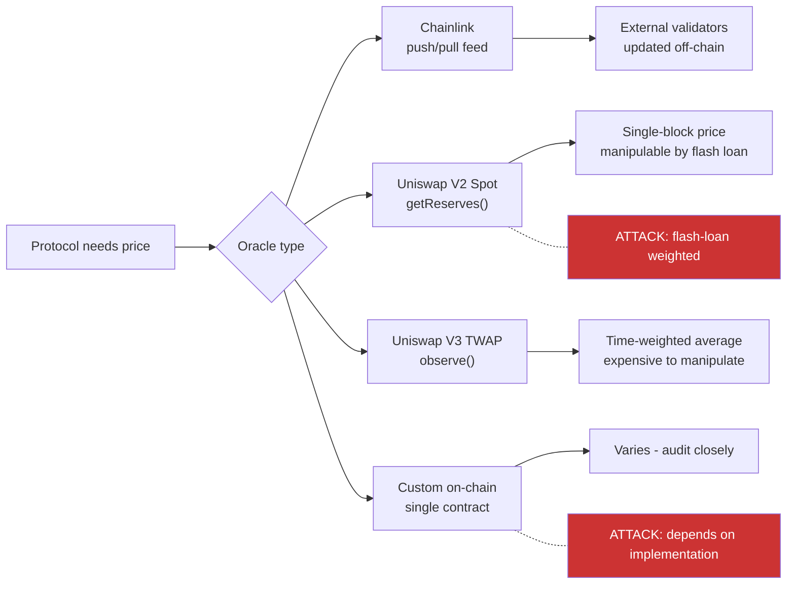
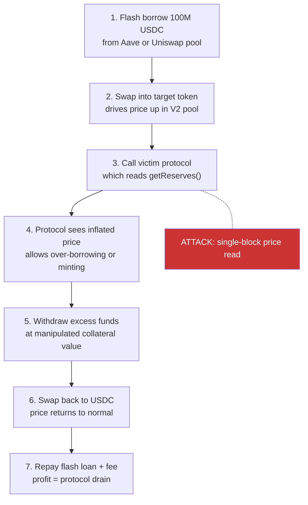

> Source: https://bugbounty.info/Attack-Surface/Web3/Oracle-Manipulation

# Oracle Manipulation

Price oracles are the single most exploited attack surface in DeFi. They feed a number  -  the price of an asset  -  into liquidation engines, swap calculations, minting ratios, and collateral valuation. If you can move that number in the same transaction you're exploiting, the entire protocol's economic logic breaks.

## Why Oracles Get Manipulated

DeFi protocols need to know the price of assets they don't directly control. They ask an oracle. The oracle reads from somewhere. If that somewhere is an on-chain pool with low liquidity, you can distort it within a single transaction using a flash loan, do your damage at the manipulated price, and repay before the block closes.

The key property: everything happens atomically within one transaction. The price doesn't need to stay manipulated. The attacker borrows 100M USDC, manipulates the pool price, drains the protocol based on the distorted price, then repays the flash loan  -  all before any block confirmation.

## Oracle Types



**Chainlink feeds** are updated by off-chain nodes on a price deviation or heartbeat schedule. They cannot be manipulated in a single transaction because the update requires off-chain consensus. You can't move a Chainlink price feed by buying tokens. The residual risk is stale data (feed not updated due to network congestion) or the protocol checking the wrong feed address.

**Uniswap V2 spot price** via `getReserves()` returns the current reserve ratio. This is the classic flash-loan target: a single large swap distorts the reserves, the price spikes, you exploit the protocol at the distorted price, swap back, repay. Any protocol using `getReserves()` as a price source is vulnerable.

**Uniswap V3 TWAP** via `observe()` returns a time-weighted average over a configurable window (typically 30 minutes). To manipulate it for a full window costs continuous capital for 30 minutes, making most flash-loan attacks economically infeasible. Shorter windows (under 10 minutes) are still attackable with enough capital.

**Custom on-chain oracles** need case-by-case analysis. Common patterns include reading reserves directly, computing a spot price from a single pool, or averaging two spot prices (which still manipulable).

## Flash-Loan-Weighted Attack

The canonical oracle manipulation flow:



```solidity
// Vulnerable pattern: reading V2 spot price directly
function getPrice(address token) public view returns (uint256) {
    (uint112 reserve0, uint112 reserve1,) = IUniswapV2Pair(pool).getReserves();
    return (reserve1 * 1e18) / reserve0;  // spot price, manipulable
}
 
// Safer: use Chainlink or TWAP with sufficient window
function getPrice(address token) public view returns (uint256) {
    (, int256 price,, uint256 updatedAt,) = AggregatorV3Interface(feed).latestRoundData();
    require(block.timestamp - updatedAt < STALE_THRESHOLD, "stale");
    return uint256(price);
}
```

## Detecting Vulnerable Oracles

```bash
# Search for getReserves() calls in source
grep -r "getReserves" contracts/
 
# Search for spot price calculations
grep -r "reserve0\|reserve1" contracts/
 
# Slither: check for price manipulation vectors
slither . --detect divide-before-multiply,incorrect-equality
```

Manual audit targets:

- Any function named `priceOf()`, `getPrice()`, `latestPrice()`, `tokenPrice()`
- Functions that call `getReserves()`, `slot0()` (Uniswap V3 spot), or `balanceOf()` on a pool
- Minting functions where collateral ratio depends on an on-chain price read
- Liquidation functions where the threshold triggers on a spot price

**Uniswap V3 `slot0()` warning:** `slot0()` returns the current tick and price from the pool state. It's a spot price, not a TWAP. Protocols that use `slot0()` instead of `observe()` are flash-loan-manipulable.

## Chainlink-Specific Issues

Even Chainlink isn't risk-free. Check for:

```solidity
// Missing staleness check  -  price could be hours old
(, int256 price,,, ) = oracle.latestRoundData();  // no updatedAt check
 
// Should be:
(, int256 price,, uint256 updatedAt,) = oracle.latestRoundData();
require(updatedAt >= block.timestamp - MAX_STALENESS, "stale price");
require(price > 0, "invalid price");
```

Other Chainlink pitfalls:

- Wrong feed address (e.g., using ETH/USD when the protocol holds stETH)
- Not handling the `answeredInRound < roundId` case (incomplete round)
- Treating the price as 18-decimal when Chainlink feeds use 8 decimals for most USD pairs

## Famous Cases

**Harvest Finance (2020)  -  $34M.** Flash loan manipulated Curve stablecoin pool prices. The attacker repeatedly swapped USDT and USDC through Curve, moved the USDC/USDT price, deposited into Harvest at the manipulated price, and withdrew at normal price. No TWAP protection.

**bZx Protocol (2020)  -  $1M+.** Two separate oracle manipulation attacks within days of each other. The first used dYdX flash loans to manipulate Kyber/Uniswap spot prices. The second abused Kyber's price slippage. Both were possible because bZx used spot price oracles.

**Mango Markets (2022)  -  $114M.** On Solana, not EVM, but the same principle. The attacker self-traded to inflate the MNGO token price, used the inflated collateral to borrow against their own position, then withdrew the borrowed funds. The attacker claimed it was a "legal market manipulation" and later returned $67M.

## Checklist

- Identify all oracle calls in the codebase: any `getPrice`, `priceOf`, `latestRoundData` function
- Check for `getReserves()` or `slot0()` used as price sources (both flash-loan manipulable)
- Verify Chainlink feeds have staleness checks and positive price validation
- Confirm Chainlink feed decimals match what the protocol expects (8 vs 18)
- Check TWAP window length: under 10 minutes is still attackable with significant capital
- Look for minting, borrowing, or liquidation thresholds that depend on a single price read
- Test if a large swap on the target's pool moves the price by more than 1% in one block
- Set up a mainnet fork and simulate the flash loan + manipulation sequence
- Check if the protocol uses multiple oracle sources and how it handles disagreement
- Look for off-chain relayers that could be fed manipulated prices externally

## Public Reports

- Harvest Finance oracle manipulation via Curve flash loan - [Rekt.news](https://rekt.news/harvest-finance-rekt/)
- bZx flash loan oracle attack - [Rekt.news](https://rekt.news/bzx-rekt/)
- Mango Markets oracle price manipulation - [Rekt.news](https://rekt.news/mango-markets-rekt/)
- Chainlink stale price used in liquidation - [Immunefi Disclosure 2023](https://immunefi.com/bug-bounty/angle/disclosed/)
- Uniswap V3 slot0 used as oracle - [Solodit 2023](https://solodit.xyz)

## See Also

- [Reentrancy](../../Attack-Surface/Web3/Reentrancy)  -  read-only reentrancy can amplify oracle manipulation
- [Integer and Precision](../../Attack-Surface/Web3/Integer-and-Precision)  -  decimal mismatches compound oracle price errors
- [Tooling](../../Attack-Surface/Web3/Tooling)  -  Tenderly for simulating flash loan sequences
- [Smart Contract Basics](../../Attack-Surface/Web3/Smart-Contract-Basics)  -  storage slots, view functions
