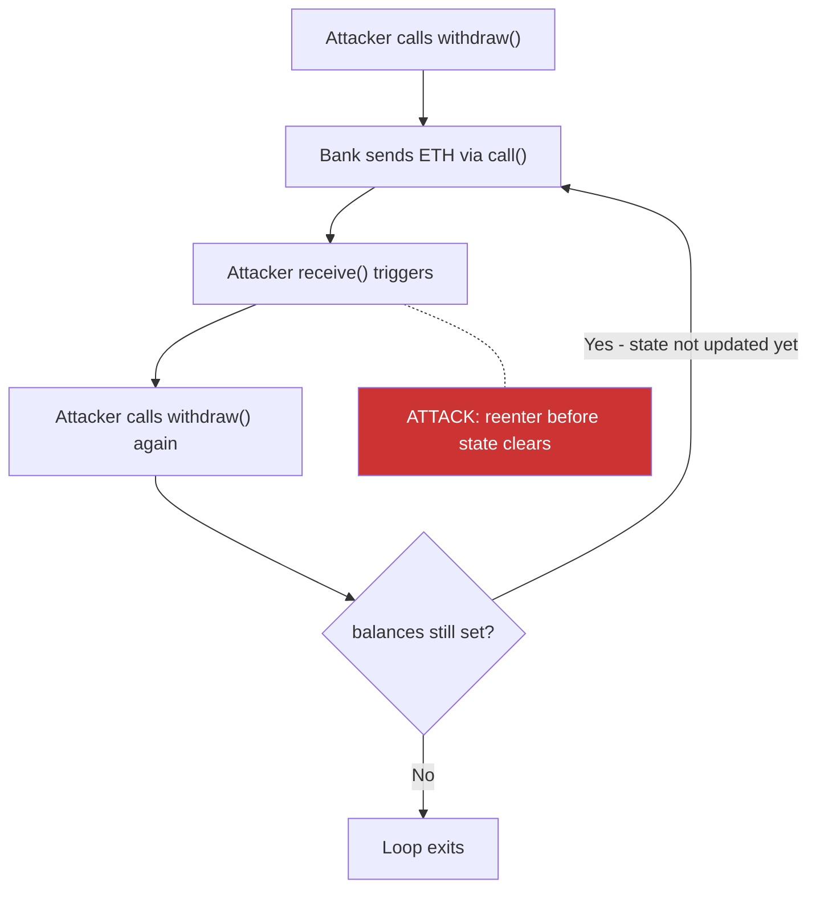

> Source: https://bugbounty.info/Attack-Surface/Web3/Reentrancy

# Reentrancy

Reentrancy is the oldest consistently-paid bug class in smart contracts. The DAO in 2016 lost $60M to a classic reentrancy. In 2021, Cream Finance lost $18.8M to a cross-contract variant. In 2022, Fei Protocol paid $80M in losses to a cross-function variant. The pattern survives because developers add `nonReentrant` to their withdrawal functions and forget that reentrancy can enter through other paths.

## Classic Reentrancy

The DAO attack pattern. A contract sends ETH before updating its state, the recipient's `receive()` or `fallback()` function calls back into the original contract before the state update completes.

```solidity
// VULNERABLE: state update after external call
contract VulnerableBank {
    mapping(address => uint256) public balances;
 
    function deposit() external payable {
        balances[msg.sender] += msg.value;
    }
 
    function withdraw() external {
        uint256 amount = balances[msg.sender];
        require(amount > 0, "nothing to withdraw");
 
        // External call BEFORE state update  -  reentrancy window here
        (bool success,) = msg.sender.call{value: amount}("");
        require(success);
 
        balances[msg.sender] = 0;  // too late
    }
}
```

The attacker deploys a contract with a `receive()` function that calls `withdraw()` again. When `call{value: amount}` executes, `balances[msg.sender]` is still the original value, so the check passes again. The loop continues until the bank is drained.

```solidity
contract Attacker {
    VulnerableBank bank;
    uint256 constant TIMES = 10;
    uint256 count;
 
    constructor(address _bank) { bank = VulnerableBank(_bank); }
 
    receive() external payable {
        if (count < TIMES) {
            count++;
            bank.withdraw();
        }
    }
 
    function attack() external payable {
        bank.deposit{value: msg.value}();
        bank.withdraw();
    }
}
```



## Cross-Function Reentrancy

Classic reentrancy enters the same function twice. Cross-function reentrancy enters a *different* function that shares the same state. Adding `nonReentrant` only to `withdraw()` does not protect against re-entering `transfer()`.

```solidity
contract VulnerableToken {
    mapping(address => uint256) public balances;
 
    // nonReentrant on withdraw  -  but not on transfer
    function withdraw() external nonReentrant {
        uint256 amount = balances[msg.sender];
        (bool ok,) = msg.sender.call{value: amount}("");
        require(ok);
        balances[msg.sender] = 0;  // attacker reenters transfer() before this line
    }
 
    function transfer(address to, uint256 amount) external {
        require(balances[msg.sender] >= amount);
        balances[msg.sender] -= amount;
        balances[to] += amount;
    }
}
```

The attacker's `receive()` calls `transfer()` during the `withdraw()` call. Their balance hasn't been zeroed yet, so they can transfer their full balance to a second address while also receiving the full ETH withdrawal.

## Read-Only Reentrancy

The most subtle variant. A view function returns stale state while a transaction is mid-execution. Another contract reads that view function during the callback window and makes decisions based on incorrect data.

This matters in DeFi when a protocol reads a price or balance from another contract that's in the middle of a state change.

```solidity
// Protocol A is being called during a Curve pool's remove_liquidity()
// Curve pool's totalSupply hasn't been updated yet, but ETH has been sent
// Protocol A reads Curve's get_virtual_price() which returns inflated price
// Protocol A mints too many tokens based on the inflated read
```

Slither's `reentrancy-no-eth` detector catches some variants, but read-only reentrancy requires manual analysis of cross-contract call sequences. The fix is either using `nonReentrant` on view functions (expensive) or ensuring external reads happen before any state changes.

## Cross-Contract Reentrancy

Two contracts share state (often a shared storage contract or a registry). Contract A calls into the attacker mid-operation. The attacker calls Contract B, which reads the shared state that Contract A hasn't finished updating.

This pattern appears frequently in:

- Vault contracts that share a price oracle
- Lending protocols where collateral and debt live in separate contracts
- Liquidity pools with callbacks (Uniswap V3 flash loans)

## Checks-Effects-Interactions and Why It Fails

The Checks-Effects-Interactions (CEI) pattern is the primary mitigation:

1. **Checks**  -  validate all conditions (`require` statements)
2. **Effects**  -  update all state variables
3. **Interactions**  -  make external calls last

```solidity
// CEI-compliant
function withdraw() external {
    uint256 amount = balances[msg.sender];   // Check
    require(amount > 0);                      // Check
    balances[msg.sender] = 0;                 // Effect  -  state updated BEFORE call
    (bool ok,) = msg.sender.call{value: amount}("");  // Interaction
    require(ok);
}
```

CEI fails in cross-function and read-only reentrancy because the "Interactions" step of one function can trigger the "Checks" step of a different function against stale state. CEI is necessary but not sufficient.

## The nonReentrant Modifier

OpenZeppelin's `ReentrancyGuard` uses a status flag in storage:

```solidity
uint256 private _status;
 
modifier nonReentrant() {
    require(_status != _ENTERED, "ReentrancyGuard: reentrant call");
    _status = _ENTERED;
    _;
    _status = _NOT_ENTERED;
}
```

Key limits:

- **Per-contract only.** `nonReentrant` on contract A does not block reentry through contract B, even if B shares state with A.
- **Not transitive.** A function without `nonReentrant` in the same contract is still enterable during a `nonReentrant` call.
- **Gas cost.** Two storage writes per call. Solidity 0.8.x with `immutable` or `transient storage` (EIP-1153) reduces this.

## Slither Detection

```bash
# Run all reentrancy detectors
slither . --detect reentrancy-eth,reentrancy-no-eth,reentrancy-benign,reentrancy-events
 
# Output: function name, path to vulnerable call, and the state variable at risk
# reentrancy-eth catches ETH-transferring reentrancy (highest severity)
# reentrancy-no-eth catches state reentrancy without ETH transfer
```

Slither misses read-only reentrancy and complex cross-contract flows. Use it as a first pass, then trace call graphs manually for DeFi protocols with callbacks.

## Famous Cases

**The DAO (2016)  -  $60M.** Classic reentrancy in the `splitDAO` function. ETH sent before the balance was updated. Triggered the Ethereum/Ethereum Classic fork.

**Cream Finance (2021)  -  $18.8M.** Cross-contract reentrancy via a flash loan callback. The attacker used CREAM's own flash loan callback to re-enter a lending function before price state was updated.

**Fei Protocol / Rari Fuse (2022)  -  $80M.** Cross-function reentrancy in Compound fork code. The `_repayBorrowFresh` function called into the attacker's contract before updating the borrow balance, allowing repeated re-borrowing.

## Checklist

- Trace every `call()`, `transfer()`, `send()`, and ERC-777/ERC-721 callback to its target
- Verify CEI order in every function that makes an external call or sends ETH
- Check that `nonReentrant` is on ALL functions sharing state, not just withdrawal functions
- Look for cross-function variants: can re-entering a different function exploit shared state?
- Check for ERC-777 `tokensReceived` hooks, ERC-721 `onERC721Received`, and ERC-1155 callbacks
- Identify any view functions that return values another contract might read during a callback
- Run Slither reentrancy detectors and review each finding
- Map all cross-contract calls where a callback could arrive before state is finalised
- Test flash loan callbacks as reentrancy entry points
- Write a Foundry PoC against a mainnet fork to confirm exploitability

## Public Reports

- Cross-function reentrancy in Fei Protocol/Rari Fuse - [Rekt.news](https://rekt.news/fei-rari-rekt/)
- Reentrancy in Cream Finance flash loan - [Rekt.news](https://rekt.news/cream-finance-rekt2/)
- Read-only reentrancy on Curve pool price - [ChainSecurity Disclosure 2022](https://chainsecurity.com/curve-lp-oracle-manipulation-post-mortem/)
- Reentrancy in Gnosis Safe module - [Immunefi Disclosure](https://immunefi.com/bug-bounty/gnosis/disclosed/)
- Classic reentrancy in vault withdraw function - [Code4rena 2023-03](https://code4rena.com/reports/2023-03-nexus)

## See Also

- [Access Control](../../Attack-Surface/Web3/Access-Control)  -  missing modifiers often compound reentrancy
- [Oracle Manipulation](../../Attack-Surface/Web3/Oracle-Manipulation)  -  read-only reentrancy enables oracle manipulation
- [Tooling](../../Attack-Surface/Web3/Tooling)  -  Slither and Foundry setup for PoC development
- [Smart Contract Basics](../../Attack-Surface/Web3/Smart-Contract-Basics)  -  call mechanics, msg.sender, receive()
