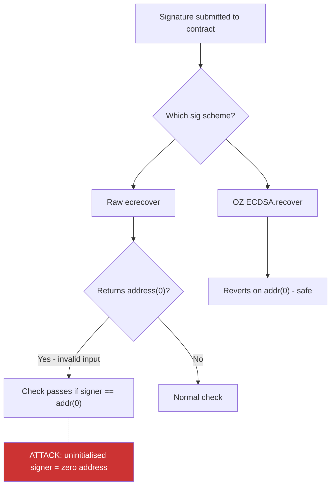

> Source: https://bugbounty.info/Attack-Surface/Web3/Signature-and-Replay

# Signature and Replay

Off-chain signatures are how EVM protocols let users authorise actions without paying gas for every on-chain transaction. The entire permit, meta-transaction, and gasless relayer ecosystem runs on them. When the signing scheme is wrong  -  missing chainId, reusable nonce, malleable signature  -  a signed message intended for one purpose becomes a weapon for another.

## EIP-712 Typed Data Signing

Before EIP-712, protocols signed raw `keccak256` hashes of arbitrary bytes. Users couldn't see what they were signing in their wallet  -  a malicious dApp could present a harmless-looking prompt while hashing a "transfer all my tokens" message.

EIP-712 structures the signed data with a domain separator and typed struct:

```solidity
// Domain separator ties the signature to a specific contract and chain
bytes32 constant EIP712_DOMAIN_TYPEHASH = keccak256(
    "EIP712Domain(string name,string version,uint256 chainId,address verifyingContract)"
);
 
bytes32 domainSeparator = keccak256(abi.encode(
    EIP712_DOMAIN_TYPEHASH,
    keccak256("MyProtocol"),
    keccak256("1"),
    block.chainid,   // chain ID
    address(this)    // contract address
));
 
// The struct being signed
bytes32 PERMIT_TYPEHASH = keccak256(
    "Permit(address owner,address spender,uint256 value,uint256 nonce,uint256 deadline)"
);
```

The domain separator binds the signature to a specific chain and contract. If `chainId` is missing from the domain separator, a signature from mainnet is valid on any other chain with the same contract address. If `verifyingContract` is missing, the same signature works on any contract that accepts the same typed struct.

## Nonce Management and Replay Protection

Nonces prevent replay attacks by ensuring each signature can only be used once. The typical pattern:

```solidity
mapping(address => uint256) public nonces;
 
function execute(address user, bytes calldata data, bytes calldata sig) external {
    bytes32 digest = keccak256(abi.encodePacked(
        domainSeparator,
        keccak256(abi.encode(TYPEHASH, user, data, nonces[user]))
    ));
    address recovered = ECDSA.recover(digest, sig);
    require(recovered == user, "invalid sig");
    nonces[user]++;  // increment BEFORE executing to prevent reentrancy
    _execute(data);
}
```

Nonce bugs to look for:

- **No nonce at all**  -  signature replayable indefinitely
- **Non-monotonic nonce**  -  if nonces are random or hash-based rather than sequential, there may be collisions
- **Nonce stored in a separate contract**  -  if that contract is upgradeable, nonces could be reset
- **Nonce not included in the signed data**  -  the nonce is checked but not covered by the signature

## Cross-Chain Replay

When a protocol deploys the same contract to multiple chains (mainnet, Arbitrum, Optimism, Base), a signature valid on one chain may also be valid on another if `chainId` isn't in the domain separator.

```solidity
// VULNERABLE: domain separator built at deployment, chainId hardcoded
bytes32 immutable DOMAIN_SEPARATOR;
 
constructor() {
    DOMAIN_SEPARATOR = keccak256(abi.encode(
        EIP712_DOMAIN_TYPEHASH,
        keccak256("Protocol"),
        keccak256("1"),
        // Missing: block.chainid  -  or was hardcoded at deploy time
        address(this)
    ));
}
```

If the protocol forks to another chain but the contract address is the same (via CREATE2 with the same salt), the `verifyingContract` check also passes. The user signed on mainnet; the attacker replays on Arbitrum.

Check for this by reading the domain separator from the contract and comparing the encoded `chainId`:

```bash
# Read the domain separator
cast call 0xCONTRACT "DOMAIN_SEPARATOR()(bytes32)" --rpc-url $RPC
 
# Decode it - compare chainId field against current chain
cast abi-decode "(bytes32,bytes32,bytes32,uint256,address)" 0xDECODED_VALUE
```

## EIP-2612 Permit and Permit2

EIP-2612 adds a `permit()` function to ERC-20 tokens, allowing off-chain approval without a separate transaction:

```solidity
function permit(
    address owner, address spender, uint256 value,
    uint256 deadline, uint8 v, bytes32 r, bytes32 s
) external;
```

Permit bugs:

- **Frontrunning permit:** a permit is sent to the mempool; a watcher sees it, uses the permit parameters to call `permit()` themselves before the owner's transaction, then calls `transferFrom()` before the owner does. The owner's transaction succeeds (permit was already used), but the owner's subsequent `transferFrom()` reverts. If the user's dApp doesn't handle this gracefully, funds may be lost.
- **Missing deadline:** if `deadline` is not validated or can be set to `type(uint256).max`, permits never expire
- **Permit on tokens that don't support it:** some protocols call `permit()` as optional and silently fall through if it reverts; an attacker can front-run and consume the permit while the protocol thinks it handled it

Permit2 (Uniswap's universal permit system) adds batch approvals and has its own attack surface around signature reuse across different Permit2 operations.

## ECDSA Malleability

Ethereum's ECDSA has a known malleability property: for any valid signature `(v, r, s)`, there exists a second valid signature `(v', r, s')` where `s' = secp256k1.order - s`. Both signatures recover to the same address.

Pre-EIP-2 (old code), both signatures were considered valid. If a protocol checks for replay protection by storing used signatures (rather than nonces), you can produce the malleable variant and replay the action.

```solidity
// VULNERABLE: stores signature hash as replay protection
mapping(bytes32 => bool) usedSigs;
 
function execute(bytes32 r, bytes32 s, uint8 v, ...) external {
    bytes32 sigHash = keccak256(abi.encodePacked(r, s, v));
    require(!usedSigs[sigHash], "replayed");
    address signer = ecrecover(messageHash, v, r, s);
    // Attacker supplies malleable (v', r, n-s) variant  -  different sigHash, same signer
    ...
    usedSigs[sigHash] = true;
}
```

OpenZeppelin's `ECDSA.recover()` normalises `s` to the lower half, preventing this. Raw `ecrecover()` does not.

## ecrecover Returns Zero

`ecrecover()` returns `address(0)` on invalid input rather than reverting. If the contract checks `recovered == expectedAddress` and `expectedAddress` is ever `address(0)`, any invalid signature passes:

```solidity
// VULNERABLE: ecrecover returns 0 on bad input
address recovered = ecrecover(digest, v, r, s);
require(recovered == authorisedSigner);
// If authorisedSigner was set to address(0) (e.g., not initialised), any sig works
```

Use OpenZeppelin's `ECDSA.recover()` which reverts on `address(0)` output.



## Checklist

- Verify the domain separator includes `chainId` and `verifyingContract`
- Check if the same contract is deployed on multiple chains with the same address  -  test cross-chain replay
- Confirm every signed message includes a per-user nonce that increments on use
- Check nonce storage is in the same contract (not a separate upgradeable contract)
- Look for permit usage and test frontrunning the permit in a forked environment
- Search for raw `ecrecover()` calls; verify the return value is never compared to `address(0)`
- Audit `s` value normalisation; confirm OpenZeppelin ECDSA is used or equivalent check
- Check deadline validation on any permit or signed order
- Test all signature functions with a zero-bytes signature to verify proper rejection
- Map all chains where the contract is deployed and verify domain separators per chain

## Public Reports

- Cross-chain signature replay due to missing chainId - [Immunefi Disclosure 2022](https://immunefi.com/blog/polygon-consensus-bypass-bugfix-review/)
- OpenSea signed order reuse after cancellation - [Rekt.news 2022](https://rekt.news/opensea-rekt/)
- Permit frontrunning in DeFi aggregator - [Immunefi Disclosure 2023](https://immunefi.com/bug-bounty/uniswap/disclosed/)
- ecrecover zero address bypass - [Immunefi Disclosure 2022](https://immunefi.com/bug-bounty/arbitrum/disclosed/)
- ECDSA malleable signature replay - [Code4rena 2022-08](https://code4rena.com/reports/2022-08-rigor)

## See Also

- [Cross-Chain Bridge](../../Attack-Surface/Web3/Cross-Chain-Bridge)  -  signature replay across bridge validators
- [Access Control](../../Attack-Surface/Web3/Access-Control)  -  signature-based auth as an alternative to on-chain roles
- [Tooling](../../Attack-Surface/Web3/Tooling)  -  cast for computing and verifying signatures
- [Smart Contract Basics](../../Attack-Surface/Web3/Smart-Contract-Basics)  -  EVM transaction model, msg.sender vs tx.origin
