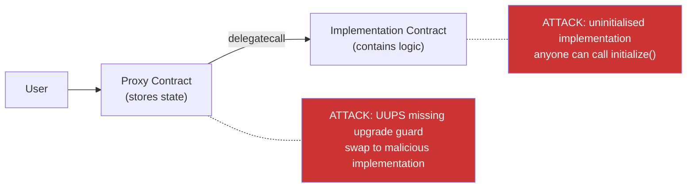

> Source: https://bugbounty.info/Attack-Surface/Web3/Smart-Contract-Basics

# Smart Contract Basics

Smart contracts are programs that live on a blockchain, execute deterministically, and can't be modified once deployed  -  unless they're designed to be upgradeable, which introduces its own class of bugs. This page is orientation for a web security researcher, not a Solidity tutorial.

## The EVM and Solidity at a Glance

The Ethereum Virtual Machine (EVM) is a stack-based virtual machine. Every contract has an address, bytecode, and persistent storage. Solidity compiles down to EVM bytecode. Transactions call functions by sending calldata to a contract address. The chain executes the bytecode and updates state.

A minimal ERC-20-style contract:

```solidity
// SPDX-License-Identifier: MIT
pragma solidity ^0.8.20;
 
contract SimpleToken {
    mapping(address => uint256) public balances;
    address public owner;
 
    constructor() {
        owner = msg.sender;
    }
 
    function mint(address to, uint256 amount) external {
        require(msg.sender == owner, "not owner");
        balances[to] += amount;
    }
 
    function transfer(address to, uint256 amount) external {
        require(balances[msg.sender] >= amount, "insufficient");
        balances[msg.sender] -= amount;
        balances[to] += amount;
    }
}
```

Key globals you'll see everywhere:

- `msg.sender`  -  the address that called the current function (could be another contract)
- `msg.value`  -  ETH sent with the call, in wei
- `tx.origin`  -  the original EOA (externally owned account) that initiated the transaction chain; differs from `msg.sender` if called via contract
- `block.timestamp`  -  current block time in seconds; manipulable by miners within ~15 seconds

## ABI and Function Selectors

The ABI (Application Binary Interface) is the schema for how to call a contract. It describes function names, parameter types, and return types. When you call a function, the first 4 bytes of calldata are the **function selector**  -  the first 4 bytes of `keccak256("functionName(paramType1,paramType2)")`.

```bash
# Compute a function selector with cast
cast sig "transfer(address,uint256)"
# 0xa9059cbb
 
# Decode calldata
cast calldata-decode "transfer(address,uint256)" 0xa9059cbb000000000000000000000000d8da6bf...
 
# Read a public state variable (storage slot 0 here)
cast storage 0xCONTRACT_ADDRESS 0 --rpc-url https://mainnet.infura.io/v3/KEY
```

Why selectors matter for bugs: two different function signatures can produce the same 4-byte selector (a collision). Rare but exploitable when a contract uses `abi.encodeWithSelector` without fully validating the target.

## Storage Slots

Contract state variables occupy storage slots numbered from 0. Mappings and dynamic arrays use `keccak256`-derived slot positions.

```solidity
contract Storage {
    uint256 public slot0;          // slot 0
    address public slot1;          // slot 1
    mapping(address => uint256) balances; // slot 2 base; actual data at keccak256(key . 2)
}
```

Storage is public on-chain regardless of Solidity visibility modifiers. `private` means other contracts can't call it; it does not mean the data is secret. You can read any slot with:

```bash
cast storage 0xCONTRACT_ADDRESS 0x2 --rpc-url $RPC
```

This matters for proxy patterns (see below) and for finding "hidden" privileged addresses or credentials stored on-chain.

## Proxy Patterns

Upgradeable contracts split logic from storage using `delegatecall`. The proxy holds storage and forwards calls to an implementation contract. The implementation's code runs in the proxy's storage context.

Three patterns you'll encounter on every major protocol:

**EIP-1967 (storage slots for implementation address):**
The implementation address lives at a specific storage slot (`0x360894...`) to avoid collisions with the proxy's own variables. The admin address at `0xb53127...`.

```bash
# Read the implementation address of an EIP-1967 proxy
cast storage 0xPROXY_ADDRESS 0x360894a13ba1a3210667c828492db98dca3e2076d4264954935e7a1cd091c2 --rpc-url $RPC
```

**Transparent Proxy (OpenZeppelin):**
Admin calls go to the proxy itself (admin functions like `upgrade`). User calls are forwarded to the implementation. The admin and user must be different addresses  -  if the admin accidentally calls a user function, it hits the proxy, not the implementation, and silently does nothing.

**UUPS (EIP-1822):**
The upgrade logic lives inside the implementation contract itself. If the implementation doesn't include the upgrade function (e.g., a developer forgot it), the contract becomes permanently non-upgradeable. The upgrade function must be protected or anyone can swap the implementation.



The classic proxy bug: a deployed implementation contract that was never initialised. Because `constructor()` runs in the implementation's own context (not the proxy's), initialisation must happen via an `initialize()` function after deployment. If nobody called `initialize()` on the implementation, you can call it and set yourself as owner, then call `upgradeTo()` and point the proxy at a selfdestruct implementation.

## Events and Off-Chain Indexing

Events are logged to the transaction receipt, not to contract storage. They're cheap to emit but can't be read by other on-chain contracts. Indexers (The Graph, Etherscan, Alchemy) use them to build queryable history.

Why they matter for bugs:

- A contract that doesn't emit events on privileged actions makes on-chain monitoring harder  -  note this in audit findings but it's rarely bounty-eligible on its own
- Off-chain systems that rely on events for critical state (e.g., a bridge relayer that watches `Deposit` events) can be manipulated if event emission is decoupled from state changes

## Testnets, Mainnet, and Local Forks

| Environment | Use | Notes |
| --- | --- | --- |
| Local anvil fork | PoC development | Fork mainnet state at a specific block; free, instant, no risk |
| Sepolia testnet | Public PoC sharing | Slow, needs faucet ETH, state is public |
| Mainnet | NEVER for bounty PoCs | Exploiting live contracts voids bounties and may be illegal |

```bash
# Fork mainnet at the latest block
anvil --fork-url https://mainnet.infura.io/v3/KEY
 
# Fork at a specific block (for historical PoC reproduction)
anvil --fork-url https://mainnet.infura.io/v3/KEY --fork-block-number 19000000
 
# Run your Foundry test against the fork
forge test --fork-url https://mainnet.infura.io/v3/KEY -vvvv
```

Local forks give you the full mainnet state (all deployed contracts, all balances) in an environment you control. This is the correct place to develop and validate every web3 PoC.

## Checklist

- Find the verified source on Etherscan or Sourcify before reading bytecode
- Identify whether the contract is a proxy; read the implementation address from EIP-1967 slots
- Check if the implementation contract was initialised after deployment
- Map all storage slots for sensitive variables (owner, admin, fee recipient)
- List all external/public functions and their access control modifiers
- Note all `delegatecall` usages and verify storage layout alignment
- Check the Solidity compiler version for pre-0.8 overflow risk
- Confirm `tx.origin` is not used for authorisation anywhere
- Identify all oracle calls and external contract dependencies
- Set up a local anvil fork before attempting any PoC

## Public Reports

- Uninitialised UUPS implementation allowing ownership takeover - [Immunefi / Wormhole](https://immunefi.com/blog/wormhole-uninitialized-proxy-bugfix-review/)
- Proxy storage collision in delegatecall leading to variable overwrite - [Code4rena 2022-09](https://code4rena.com/reports/2022-09-frax)
- tx.origin authorisation bypass on a bridge contract - [Immunefi Disclosure 2023](https://immunefi.com/bug-bounty/across/disclosed/)
- Storage slot collision between proxy and implementation - [Immunefi Blog 2022](https://immunefi.com/blog/polygon-lack-of-balance-check-bugfix-review/)

## See Also

- [Tooling](../../Attack-Surface/Web3/Tooling)  -  Foundry, cast, anvil setup
- [Access Control](../../Attack-Surface/Web3/Access-Control)  -  uninitialised proxy bugs in depth
- [Reentrancy](../../Attack-Surface/Web3/Reentrancy)  -  requires understanding of call mechanics covered here
- [Web3 Overview](../../Attack-Surface/Web3/)  -  Immunefi scope and platform rules
