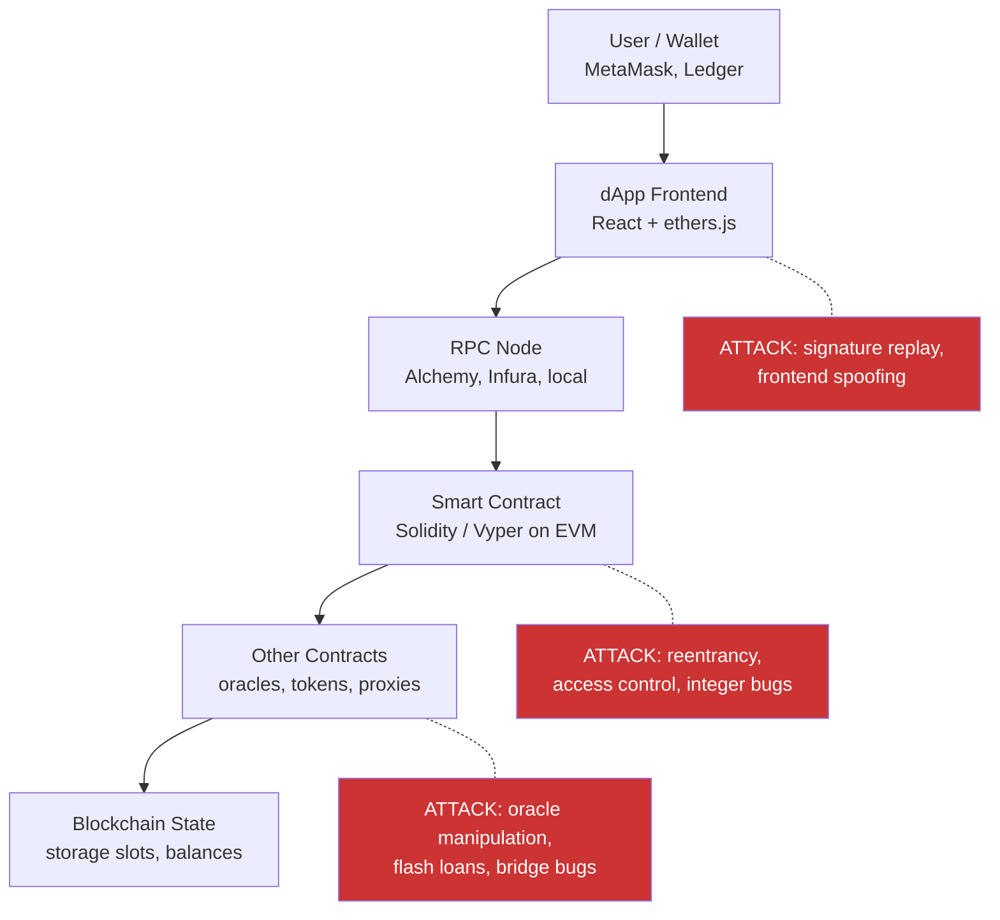

> Source: https://bugbounty.info/Attack-Surface/Web3/index

# Web3 & Smart Contracts

Web3 bug bounty is code review with money on the line. There's no login to bypass, no intercepting traffic in Burp  -  the code is public, the state is public, and every transaction is permanent. A single vulnerability in a DeFi protocol can drain hundreds of millions of dollars in one block.

## How Web3 Bug Bounty Differs from Web2

The mechanics are different enough to warrant their own mental model.

**Public code is the whole game.** Smart contracts are deployed on-chain; the bytecode (and usually the Solidity source via Etherscan verification) is publicly readable. You audit the code the same way a compiler does. There's no hidden server-side logic to discover through fuzzing headers.

**Primacy of disclosure, not exploitation.** On Immunefi, the dominant web3 platform, the rule is firm: you find it, you report it, you wait. Exploiting a live vulnerability to prove it  -  even returning the funds  -  usually voids the bounty and may constitute theft under the platform's rules. The whitehat escrow process exists for edge cases involving live funds at risk.

**No-mainnet-exploitation rule.** PoCs go in local fork environments (Foundry's anvil, Hardhat's network) or on testnets, not on mainnet. See [Tooling](../../Attack-Surface/Web3/Tooling) for the forked-mainnet workflow.

**Scope on Immunefi is tiered by impact.** Critical findings (usually $500K+ protocols) can pay $50K to $10M+. Smart contract bugs are almost always the scope. Frontend bugs, admin key compromise, and social engineering are typically out of scope.

## The EVM Stack

## Immunefi Scope Conventions

Immunefi programs list assets by contract address and categorise bugs by severity:

- **Critical** - direct theft of funds, permanent freezing of funds, minting unbounded tokens
- **High** - temporary freezing, theft below a threshold, governance manipulation
- **Medium** - griefing, temporary DoS, minor losses
- **Low** - cosmetic issues, events not emitted, informational

Each program sets its own bounty table. Read the scope carefully before starting  -  many programs exclude specific contract versions, specific functions, or require a minimum loss threshold. See [Immunefi](../../Programs/Platforms/Immunefi) for platform-specific guidance.

## Pages in This Section

- [Smart Contract Basics](../../Attack-Surface/Web3/Smart-Contract-Basics)  -  ABI, storage slots, proxy patterns, testnets. Start here if you're new to Solidity.
- [Reentrancy](../../Attack-Surface/Web3/Reentrancy)  -  classic, cross-function, read-only, and cross-contract variants. The DAO was 2016; protocols still get hit.
- [Oracle Manipulation](../../Attack-Surface/Web3/Oracle-Manipulation)  -  price oracles, flash-loan-weighted attacks, spot vs TWAP. Responsible for some of the largest DeFi losses.
- [Access Control](../../Attack-Surface/Web3/Access-Control)  -  missing modifiers, uninitialised proxies, delegatecall confusion, tx.origin vs msg.sender.
- [Integer and Precision](../../Attack-Surface/Web3/Integer-and-Precision)  -  overflow/underflow, rounding direction, decimal mismatches, share inflation attacks.
- [Signature and Replay](../../Attack-Surface/Web3/Signature-and-Replay)  -  EIP-712, nonce management, cross-chain replay, permit frontrunning, ecrecover edge cases.
- [MEV and Frontrunning](../../Attack-Surface/Web3/MEV-and-Frontrunning)  -  what counts as a bounty finding vs ambient mempool reality, sandwich attacks, commit-reveal failures.
- [Cross-Chain Bridge](../../Attack-Surface/Web3/Cross-Chain-Bridge)  -  the largest loss category in web3 history. Signature bypass, Merkle proof bugs, validator compromise.
- [Tooling](../../Attack-Surface/Web3/Tooling)  -  Foundry, Slither, Echidna, Tenderly, Chisel. The standard toolkit for PoC development and static analysis.

## See Also

- [Immunefi](../../Programs/Platforms/Immunefi)  -  platform rules, whitehat escrow, payout tiers
- [Tooling](../../Attack-Surface/Web3/Tooling)  -  start here before writing any PoC
