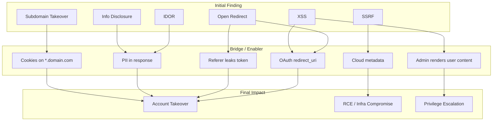

> Source: https://bugbounty.info/Chains/index

# Chains

This is where the money is.

A standalone medium-severity bug earns you $500-$2,000 depending on the program. That same medium, chained with one or two other findings into a complete attack scenario, earns $5,000-$50,000. Those numbers aren't made up. The delta between "I found an open redirect" and "I found an open redirect that enables account takeover of any user via OAuth token theft" is often a 10-20x multiplier.

Every chain starts with understanding what position each vulnerability gives you and what's reachable from that position.

## Chain Pattern Map

## Chain Patterns

### [Open Redirect -> OAuth Account Takeover](../Chains/Open-Redirect-to-ATO)

Low -> Critical. The classic chain. Requires an OAuth implementation with a redirect_uri that can be manipulated to include your open redirect.

### [SSRF -> Cloud Metadata -> RCE](../Chains/SSRF-to-Cloud-RCE)

Medium -> Critical. Any SSRF on a cloud-hosted app. Hit the metadata endpoint, grab IAM creds, enumerate permissions, escalate.

### [XSS -> Admin Action -> Privilege Escalation](../Chains/XSS-to-Privilege-Escalation)

Medium -> Critical. Stored XSS that fires in a privileged context. Use the admin's session to perform admin actions programmatically.

### [IDOR -> PII Leak -> Account Takeover](../Chains/IDOR-to-ATO)

Medium -> Critical. IDOR leaks enough user data to enable password reset, security question bypass, or API key theft.

### [Subdomain Takeover -> Cookie Theft](../Chains/Subdomain-Takeover-to-Session)

Medium -> High/Critical. Take over an abandoned subdomain, use it to read cookies scoped to the parent domain.

### [Race Condition -> Financial Impact](../Chains/Race-Condition-to-Financial)

Medium -> High. Race condition on a payment, transfer, or reward redemption flow. Demonstrate actual monetary loss.

### [Info Disclosure -> Full Exploitation](../Chains/Info-Disclosure-to-Full-Exploit)

Low -> Varies. The finding the triager wants to close as informational, until you show what an attacker does with the disclosed data.

### [XSS -> Account Takeover](../Chains/XSS-to-Account-Takeover)

Medium -> Critical. Stored XSS fires in the victim's browser, steals the session cookie or storage-based bearer token, and replays it. When HttpOnly blocks cookies, the payload acts as the victim directly via CSRF-adjacent requests.

### [CSRF -> Account Takeover](../Chains/CSRF-to-ATO)

Medium -> Critical. CSRF on the email-change endpoint silently swaps the victim's recovery address. Attacker triggers a password reset to their own inbox and completes the login.

### [OAuth Misconfiguration -> Account Takeover](../Chains/OAuth-Misconfig-to-ATO)

Medium -> Critical. Three variants: weak redirect_uri validation ships the authorisation code to an attacker server, missing state enables CSRF on the OAuth flow, and implicit-flow tokens leak through Referer headers.

### [File Upload -> RCE](../Chains/File-Upload-to-RCE)

High -> Critical. Upload bypass - extension blacklist, MIME check, magic byte, .htaccess overwrite, nginx/php-fpm path confusion - lands a webshell in an executable path.

### [Prototype Pollution -> DOM XSS or RCE](../Chains/Prototype-Pollution-to-Exploit)

Medium -> Critical. Client-side: polluted property reaches a DOM sink. Server-side: Node.js gadget in Handlebars or EJS turns prototype write into OS command execution.

### [SSTI -> RCE](../Chains/SSTI-to-RCE)

High -> Critical. Server-side template injection across Jinja2, Twig, Freemarker, and Handlebars. Each engine has a documented path to `os.popen` or equivalent.

### [Subdomain Takeover -> OAuth Account Takeover](../Chains/Subdomain-Takeover-to-OAuth)

Medium -> Critical. Claim an abandoned subdomain registered as an OAuth redirect_uri. Every user who authenticates via that OAuth flow sends their authorisation code to the attacker.

### [IDOR + Mass Assignment -> Privilege Escalation](../Chains/IDOR-and-Mass-Assignment)

Medium -> Critical. Write IDOR on a user-update endpoint combined with mass assignment on role fields - attacker elevates any account to admin without knowing the target's credentials.

### [XXE -> SSRF -> Cloud RCE](../Chains/XXE-to-SSRF-to-RCE)

High -> Critical. XXE in a SOAP or XML endpoint fetches the cloud metadata URL via entity resolution. IAM credentials from the metadata response chain directly into the SSRF-to-Cloud-RCE pattern.

### [GraphQL BFLA -> Mass Data Extraction](../Chains/GraphQL-BFLA-to-Extraction)

High -> Critical. Introspection reveals privileged mutations and queries. Broken function-level authorisation lets a low-privilege user run them. Query aliasing bypasses per-request rate limits for bulk exfiltration.

### [Self-XSS -> Exploitable via Login CSRF or Clickjacking](../Chains/Self-XSS-to-Exploitable)

Low -> High. Self-XSS only fires in the attacker's session. Login CSRF forces the victim into that session, then navigates them to the XSS page. The payload fires in the victim's browser.

### [Prompt Injection -> Data Exfiltration](../Chains/Prompt-Injection-to-Data-Exfil)

High -> Critical. Indirect prompt injection in a document read by an AI agent. The agent uses the victim's OAuth-connected tools to exfiltrate emails, files, or messages to an attacker-controlled endpoint.

## Building Your Own Chains

The patterns above are documented because they're common. But the most valuable chains are the ones specific to the application you're testing. Methodology for discovering them is in [Chain Thinking](../Methodology/Chain-Thinking).

Short version: every time you find something, stop and map what new position it gives you. Look at what's accessible from that position. If you can't escalate right now, note it and come back when you find the missing link.

## See Also

- [Chain Thinking](../Methodology/Chain-Thinking)
- [Severity Escalation](../Reporting/Severity-Escalation)
