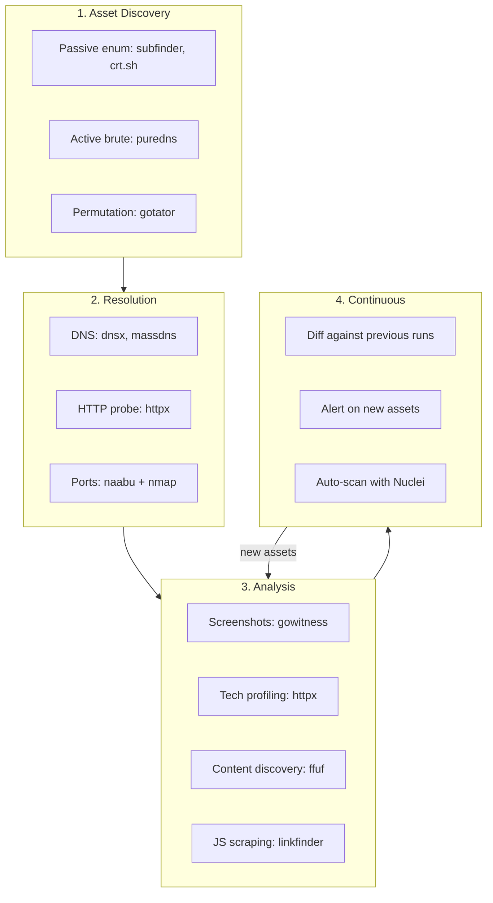

> Source: https://bugbounty.info/Recon/index

# Recon

Recon isn't a phase you do once and move on from. It runs alongside your hunting, continuously. The targets that pay best are the ones nobody else has found yet. The forgotten staging server, the internal tool accidentally exposed after a deploy, the acquisition from three years ago still running on the original infrastructure.

If you're only testing what's in the scope document, you're competing with everyone else who read the same document. If you're finding assets the program owner forgot they had, you're competing with almost nobody.

## Recon Pipeline Architecture

A mature recon setup isn't one tool. It's an orchestrated pipeline where each stage feeds the next.

## Sections

### Asset Discovery

- **[Subdomain Enumeration](../Recon/Subdomain-Enumeration)** - Passive, active, and permutation-based approaches. Going beyond what subfinder gives you out of the box.
- **[ASN Mapping](../Recon/ASN-Mapping)** - Company name to ASN to CIDR ranges. Finds live IP space that DNS enumeration never reaches.
- **[Certificate Transparency](../Recon/Certificate-Transparency)** - Beyond subdomain enum: cert pivoting by organisation name, expired wildcard history, and internal-named CNs.
- **[Cloud Range Discovery](../Recon/Cloud-Range-Discovery)** - Mapping IP ranges back to cloud providers, finding S3 buckets and Azure blobs.
- **[Monitoring & Diffing](../Recon/Monitoring)** - Running recon on a schedule and alerting on changes. New subdomain or new open port means a target that hasn't been tested yet.

### Enumeration

- **[Port & Service Scanning](../Recon/Port-Scanning)** - Masscan for speed, nmap for accuracy. The combo workflow that covers 65k ports without taking all day.
- **[Content Discovery](../Recon/Content-Discovery)** - Directory bruting, wordlist selection, recursive fuzzing. The wordlist matters more than the tool.
- **[JavaScript Analysis](../Recon/JavaScript-Analysis)** - Extracting endpoints, API routes, secrets, and internal paths from JS bundles. Consistently one of the highest-value things you can do during recon.
- **[API Endpoint Discovery](../Recon/API-Discovery)** - Finding undocumented APIs, GraphQL introspection when it's "disabled," reverse engineering mobile app traffic.
- **[API Documentation Discovery](../Recon/API-Documentation-Discovery)** - Swagger, OpenAPI, Postman, and GraphQL playground endpoints. A full endpoint list handed to you without brute-forcing.
- **[Parameter Discovery](../Recon/Parameter-Discovery)** - Hidden parameters that aren't in the HTML. Arjun, param miner, and the manual approach.
- **[robots.txt, security.txt & sitemap.xml](../Recon/robots-and-security.txt)** - First-touch recon: admin paths from robots.txt, programme details from security.txt, URL map from sitemap.xml.

### Fingerprinting & Intelligence

- **[Shodan, Censys & FOFA](../Recon/Shodan-Censys-Fofa)** - Three internet scan engines, their query syntax, favicon hashing, and when each one wins.
- **[Tech Fingerprinting](../Recon/Tech-Fingerprinting)** - Identifying the stack per host, mapping tech to CVE feeds, and building a triage priority list.
- **[Mobile App Recon](../Recon/Mobile-App-Recon)** - APK and IPA as a recon source: endpoints, hardcoded keys, deep links, and paths the web app never exposes.
- **[SaaS Enumeration](../Recon/SaaS-Enumeration)** - Zendesk, Salesforce Communities, ServiceNow, Atlassian, Okta  -  the third-party platforms that sit outside the normal security review cycle.

### OSINT

- **[GitHub Dorking](../Recon/GitHub-Dorking)** - Credentials, internal paths, config files, old code. GitHub is an intelligence goldmine if you know what queries to run.
- **[Wayback Machine Mining](../Recon/Wayback-Mining)** - Endpoints that got removed are often still functional. Features "deleted" from the UI but not from the backend.
- **[Acquisitions & Mergers](../Recon/Acquisitions)** - When BigCorp acquires StartupCo, StartupCo's infrastructure often stays on the original stack for years. Nobody patches it, nobody remembers it, it's in scope.
- **[OSINT on Employees](../Recon/OSINT-on-Employees)** - LinkedIn, GitHub profiles, breach databases, and username enumeration. The human attack surface and leaked credentials still in use.
- **[Exposed Git Repositories](../Recon/Exposed-Git)** - `.git/` directories left on web servers. git-dumper, full history mining, SVN and Mercurial variants.

### Automation

- **[Building a Recon Pipeline](../Recon/Pipeline)** - Orchestrating the above into something that runs while you sleep.
- **[Data Management](../Recon/Data-Management)** - Storing, querying, and deduplicating recon output when you're tracking dozens of targets.

## The One Recon Tip That Actually Matters

Everyone focuses on tool selection. "Should I use subfinder or amass?" Doesn't matter. They both pull from the same sources.

What matters is what you do after the tools finish. The gap between "I ran subfinder and got 500 subdomains" and "I found a P1 on an asset nobody else tested" is entirely in the analysis phase. Screenshot everything. Actually look at the screenshots. Notice the staging server running an old version of the app. Notice the admin panel on port 8443. Notice the subdomain that returns a completely different tech stack from everything else.

Recon tools generate data. Hunters generate findings. The gap between those two things is judgment, pattern recognition, and curiosity. None of that can be automated.
